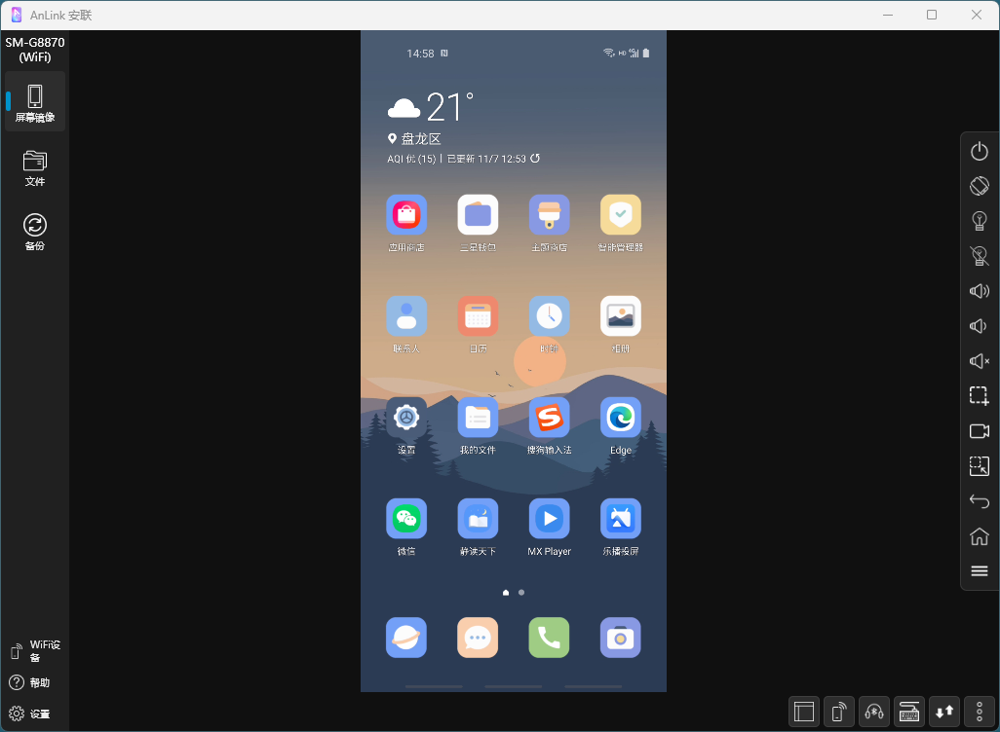

## 软件简介

AnLink 是一款免费的、用户友好的软件，允许您直接从您的 Windows 或 macOS 电脑控制和管理您的安卓智能手机或平板电脑。它使用标准的 USB 数据线连接或 Wi-Fi，将您手机的屏幕镜像到电脑上，让您可以使用电脑的键盘和鼠标来操作移动应用、发送消息和管理文件。

它是其他屏幕镜像软件（如 Scrcpy，它正是基于此开发）和付费软件（如 Vysor）的一个热门替代品，但其侧重点在于简洁性和精美的用户界面。

::: center

:::

::: center

:::

## 功能特性

- **高质量屏幕镜像：** 以低延迟、高质量（最高可达 1080p 60帧）实时将您的安卓屏幕镜像到电脑。

- **使用键盘和鼠标：** 这是其最吸引人的功能之一。您可以使用物理键盘打字，用鼠标控制手机，使得处理消息、电子邮件甚至某些游戏等任务效率大大提高。

- **文件传输（拖放）：** AnLink 内置文件管理器。您可以轻松地在电脑和手机之间拖放文件，无需额外的数据线或应用。

- **多开支持：** 您可以运行多个 AnLink 实例，在一台电脑上同时控制多个安卓设备。这对于开发者、社交媒体管理员或任何需要管理多部手机的用户非常有用。

- **Wi-Fi 连接：** 在首次通过 USB 设置后，您可以通过 Wi-Fi 将手机连接到 AnLink，实现无线自由使用。

- **简洁直观的界面：** 界面简单明了，易于操作，使得非技术用户也能轻松上手。主要控制项位于一个透明的侧边栏上，当鼠标移动到屏幕边缘时会出现。

- **无需 Root 权限：** AnLink 在大多数安卓手机上无需 Root 权限即可工作。

- **音频支持（有限）：** 某些版本和配置允许将手机音频传输到电脑，这是一个并非所有同类工具都具备的功能。

## 系列文章



## 下载地址

::: download

:::

## 软件授权

:::

:::
