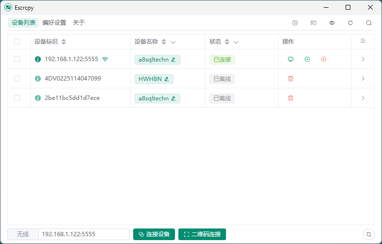

## 软件简介

Escrcpy，一款基于 Scrcpy 开发的图形化安卓手机投屏控制软件，它不仅免费、开源，而且功能强大。而且最新版本新增虚拟显示功能，可以同时启动多个安卓应用，投屏到电脑后，使用鼠标、键盘控制。

::: center




:::

::: center



:::

## 功能特性

- **同步：** 利用 Web 技术更快地与 Scrcpy 同步
- **自动化：** 设备自动连接、自动执行镜像、自定义脚本、定时任务
- **自定义：** 多设备管理、独立配置、自定义备注、配置导入/导出
- **无线连接：** 扫描二维码即可快速连接
- **反向网络共享：** 通过 Gnirehtet 进行反向网络共享
- **窗口编排：** 可视化拖拽界面，精确控制多设备窗口布局，支持自定义位置和尺寸
- **主题模式：** 亮色模式、暗色模式、系统模式自动切换
- **轻量级：** 原生支持，仅显示设备屏幕
- **高性能：** 根据设备支持 30-120 帧率
- **高清画质：** 支持 1920×1080 或更高分辨率
- **低延迟：** 仅 35~70 毫秒
- **极速启动：** 约 1 秒内显示首帧画面
- **无侵入：** 不会在 Android 设备上留下任何安装残留
- **用户体验：** 无需账号、无广告、无需联网
- **自由：** 免费且开源软件

## 系列文章



## 下载地址

::: download


:::

## 软件授权

:::


:::

## 开源协议

Escrcpy 源码遵循 [Apache-2.0](https://github.com/viarotel-org/escrcpy?tab=Apache-2.0-1-ov-file) 协议进行分发和使用。
