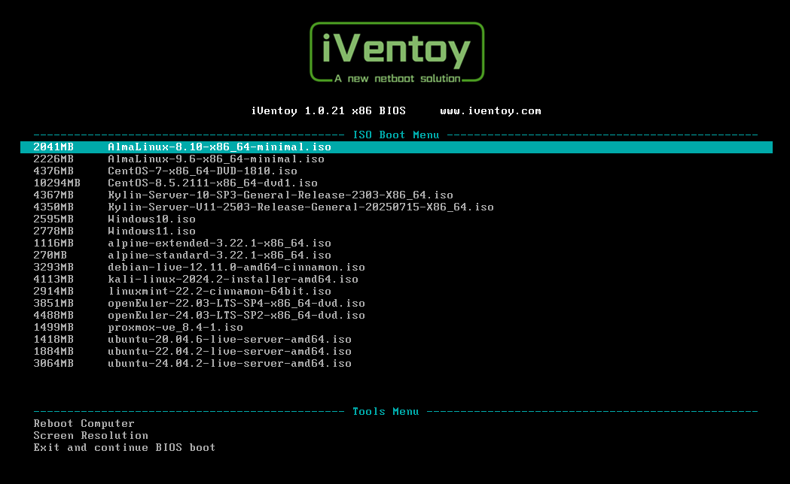
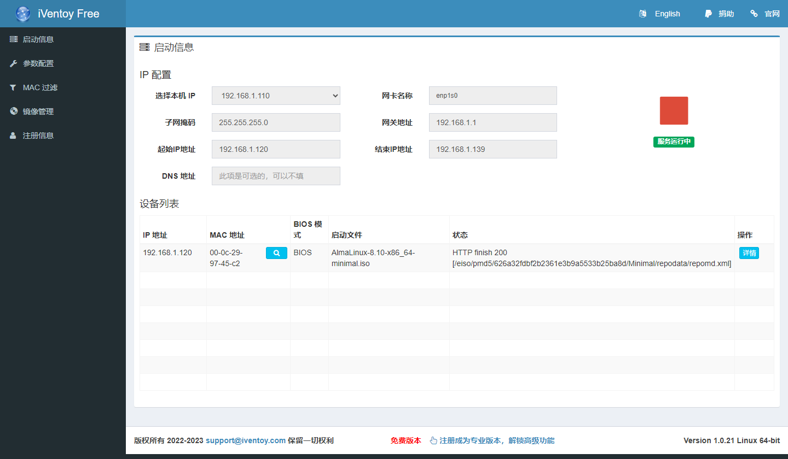
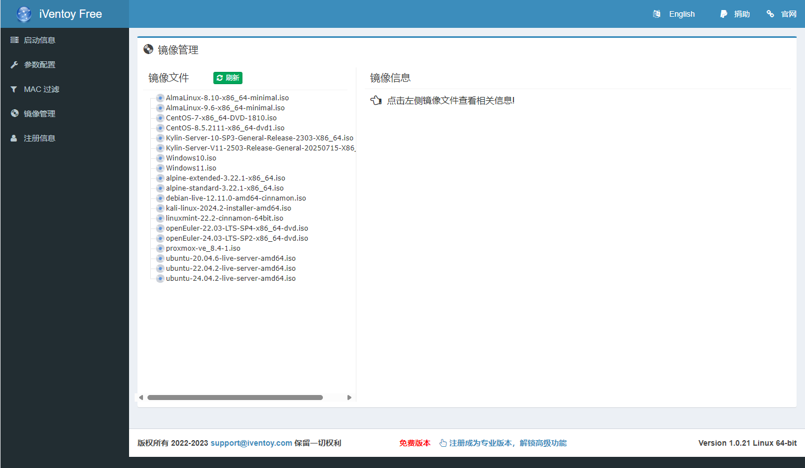

## 软件简介

iVentoy 可以看成是一个增强版的 PXE 服务器。 使用 iVentoy 你可以通过网络同时给多台机器启动、安装操作系统。使用极其简单，无需复杂的配置，直接把 ISO 文件放到指定位置，客户机在启动时根据菜单选择要启动的 ISO 文件即可。同时支持 x86 Legacy BIOS、IA32 UEFI、x86_64 UEFI 和 ARM64 UEFI 模式，支持 110 多种常见类型的操作系统。

{.cover}

::: center


:::

::: center


:::

## 功能特性

- 软件使用非常简单。
- 软件跨平台，支持运行在 Windows 和 Linux 系统中。
- 软件专门针对 PXE 场景优化设计，功能灵活。
- 支持 ISO 文件直接启动，无需提取内部文件。
- 保留原始 ISO 文件的启动菜单风格。
- 启动菜单和文件目录结构一一对应。
- 同时支持 Legacy BIOS 以及 IA32/X86_64/ARM64 的 UEFI 模式。
- 支持 110 多种常见的操作系统 （Windows/WinPE/Linux/VMware）。
- 支持整体及单个 ISO 文件的启动密码保护。
- 支持多台设备同时安装不同操作系统。
- 支持和第三方 DHCP Server 配合工作。
- 支持通过 MAC 地址进行设备过滤。
- 支持查询 MAC 地址过滤状态。
- 支持 MAC 地址归属查询。
- 支持客户端设备信息查询。（厂商名、产品名、序列号等）
- 提供 HTTP 直接获取 ISO 内部文件的功能。
- 支持启动文件注入功能。
- 支持注入并自动执行脚本的功能。
- 支持 Windows 系统的自动安装部署。
- 支持 Linux 系统的自动安装部署。
- Windows/Linux 自动安装脚本中支持变量扩展。
- 自动解决 Linux 安装过程中缺少网卡驱动的问题。

## 效果展示

:::

:::

## 系列文章



## 下载地址

::: download

:::

## 软件授权

:::


:::

> 如果您打算在公司中使用 iVentoy，则必须购买许可证。
