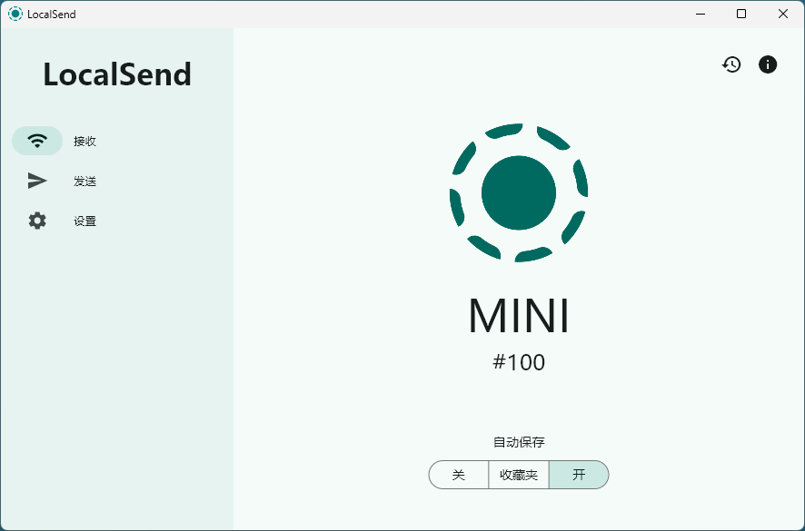

## 软件简介

LocalSend 是一个自由、开源的应用程序，允许你在本地网络上安全地与附近设备分享文件和消息，无需互联网连接。

LocalSend 是一个跨平台应用程序，使用 REST API 和 HTTPS 加密实现设备之间的安全通信。与依赖外部服务器的其他消息应用程序不同，LocalSend 不需要互联网连接或第三方服务器，因此成为本地通信的快速可靠解决方案。

{.cover}

::: center


:::

::: center





:::

## 功能特性

### 核心优势

- **跨平台兼容性：** LocalSend 支持 Windows、macOS、Linux、iOS、Android 五大主流系统，彻底打破不同品牌与操作系统的壁垒。无论是 iPhone 传 Windows 电脑，还是安卓手机与 Mac 互传文件，均能轻松实现。

- **纯本地传输，无需互联网：** 通过局域网（Wi-Fi 或热点）直接传输，文件不经过任何第三方服务器，既节省流量又避免隐私泄露风险。实测在 Wi-Fi 6 环境下，传输速度可达 40~50MB/s。

- **开源免费，无广告干扰：** 作为开源软件，LocalSend 代码透明且完全免费，无广告或功能限制，用户可自由使用及定制。

### 功能亮点

- **自动发现设备，一键传输：** 打开软件即自动扫描同一网络内的设备，无需手动配对或扫码。发送文件时，仅需选择目标设备并点击发送，接收端确认即可完成传输。

- **支持批量文件与文本传输：** 可一次性选择多个文件或文件夹发送，大幅提升效率。此外，它还支持跨设备发送文本消息（如网址、代码片段），实现剪贴板无缝同步。

- **个性化设置与历史记录：** 用户可自定义保存路径、设备名称，并开启 "自动接收" 模式以简化操作。传输历史记录功能便于回溯文件来源与时间。

### 适用场景

- **家庭共享：** 快速传输家庭照片、视频至电视或平板，无需依赖云盘。
- **团队协作：** 在办公局域网内，成员间秒传大体积设计稿或视频素材，避免微信压缩画质。
- **应急传输：** 通过手机热点连接电脑，实现无网络环境下的文件互传。
  
## 系列文章



## 下载地址

::: download


:::

## 软件授权

:::


:::

## 开源协议

LocalSend 源码遵循 [Apache-2.0](https://github.com/localsend/localsend?tab=Apache-2.0-1-ov-file) 协议进行分发和使用。
