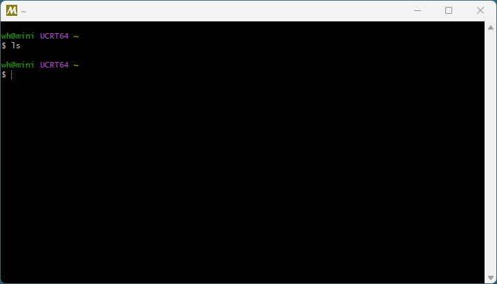

## 软件简介

MSYS2 是一个在 Windows 上提供类似于 Linux 开发环境的工具集。它的核心是一个基于现代 Cygwin 和 MinGW-w64 的软件分发和构建平台。你可以把它理解为一个 “Windows 上的迷你 Linux 终端”。

::: center



:::

::: center

:::

## 功能特性

1. **一个 Bash Shell 命令行环境**：让你可以使用熟悉的 Linux 命令，如 `ls`, `grep`, `ssh`, `curl`, `vim` 等，而不是 Windows 自带的 CMD 或 PowerShell。

2. **一个强大的软件包管理器：`pacman`**：这是源自 Arch Linux 的包管理器。通过它，你可以轻松地安装、更新和卸载成千上万的开发工具和库，比如 GCC（GNU 编译器集合）、Python、Git、Make 等等。

3. **一个用于编译 Windows 本地程序的环境**：这是它最关键的功能之一。它集成了 MinGW-w64，可以让你编译出 **原生的 Windows 应用程序（.exe）**，这些程序不依赖于 Cygwin 的 POSIX 模拟层，因此性能更好，更轻量。

## 核心组件

为了更好地理解，我们来看看 MSYS2 启动时让你选择的几个环境：

- **MSYS**：这是"纯粹"的 POSIX 环境，路径使用 `/c/` 开头（如 `/c/Windows/`），主要用于在 Windows 上构建类似 Autotools 的、为 Linux 设计的项目。编译出的程序依赖于 `msys-2.0.dll`。

- **MINGW64**：这是**最常用**的环境，用于编译 **64 位** 原生的 Windows 程序。它使用 Windows 风格的路径（如 `C:\Windows\`），编译出的程序是原生的，不依赖 MSYS2 的动态库。

- **MINGW32**：用于编译 **32 位** 原生的 Windows 程序。

- **UCRT64**：与 MINGW64 类似，但它使用较新的 **Universal C Runtime (UCRT)**，这是 Windows 10 及以后版本推荐的运行时库。未来可能会成为主流。

**简单比喻：**

- **MSYS2** 是**整个房子**（整个环境）。

- **`pacman`** 是房子的**物业和送货服务**（包管理器）。

- **MSYS / MINGW64 / MINGW32** 是房子里的**不同功能的房间**，用于不同的目的。

## 使用场景

MSYS2 的应用非常广泛，以下是几个最典型的使用场景：

### 在 Windows 上进行 C/C++ 开发

这是 MSYS2 最核心的用途。如果你需要在 Windows 上编译 C/C++ 代码，但又不想安装庞大且配置复杂的 Visual Studio，MSYS2 是绝佳选择。

- **安装 GCC 编译器**：只需一行命令 `pacman -S mingw-w64-x86_64-gcc` 即可安装最新的 GCC。

- **管理第三方库**：你可以轻松安装像 OpenSSL、SDL2、FFmpeg、Boost、Qt 这样的库。例如 `pacman -S mingw-w64-x86_64-qt5`。

- **构建来自 Linux 世界的项目**：许多开源项目（如使用 Makefile 或 Autotools 的）可以直接在 MSYS2 环境中进行编译，而无需大幅修改构建脚本。

### 作为其他软件和框架的依赖或基础

许多著名的项目都依赖或推荐使用 MSYS2 环境：

- **Git for Windows**：其官方版本就是基于 MSYS2 构建的。

- **FFmpeg**：在 Windows 上编译 FFmpeg 时，MSYS2 是最推荐的环境之一。

- **Python 科学计算栈**：一些用于科学计算的 Python 包（如 `numpy`, `scipy`）在 Windows 上预编译的 wheel 文件就是使用 MSYS2/MINGW 工具链构建的。

- **Rust**：Rust 在 Windows 上默认使用 MSVC 工具链，但也可以轻松切换到 GNU 工具链，后者就依赖于 MSYS2。

### 为熟悉 Linux 的开发者提供舒适的命令行

对于从 Linux 或 macOS 转到 Windows 的开发者和系统管理员，Windows 自带的 CMD 和 PowerShell 用起来可能不太习惯。MSYS2 提供了一个几乎无缝过渡的 Bash Shell，让你可以继续使用熟悉的命令行工具（`grep`, `sed`, `awk`, `rsync`, `ssh` 等），大大提升了工作效率。

### 软件包管理和脚本自动化

通过 `pacman`，你可以轻松地在多台机器上部署和保持一致的开发环境。你也可以编写 Bash 脚本，利用强大的 GNU 工具链在 Windows 上实现复杂的自动化任务。

## 系列文章



## 下载地址

::: download

:::

## 软件授权

:::


:::

## 开源协议

MSYS2 源码遵循 [MIT](https://github.com/msys2/setup-msys2?tab=MIT-1-ov-file) 协议进行分发和使用。
