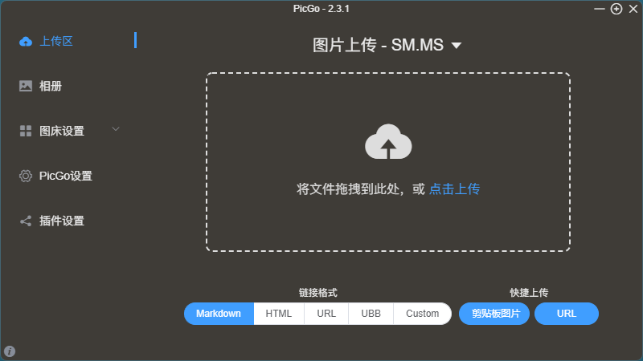

## 软件简介

PicGo 是一款开源跨平台的免费图片上传工具以及图床相册管理软件，它能帮你快速地将图片上传到微博、又拍云、阿里云 OSS、腾讯云 COS、七牛、GitHub、sm.ms、Imgur 等常见的免费图床网站或云存储服务上，并自动复制图片的链接到剪贴板里，使用上非常高效便捷。

{.cover}

::: center



:::

::: center




:::

## 功能特性

- 支持拖拽图片上传
- 支持快捷键上传剪贴板里第一张图片
- Windows 和 macOS 支持右键图片文件通过菜单上传
- 上传图片后自动复制链接到剪贴板
- 支持自定义复制到剪贴板的链接格式
- 支持修改快捷键，默认快速上传快捷键
- 支持插件系统，已有插件支持 Gitee、青云等第三方图床
- 支持通过发送 HTTP 请求调用 PicGo 上传

## 系列文章



## 下载地址

::: download


:::

## 软件授权

:::
{% btn https://picgo.github.io/PicGo-Doc/zh/guide/#%E8%B5%9E%E5%8A%A9, 免费 - 捐赠助力, iconfont icon-coffee, red outline %}

:::

## 开源协议

PicGo 源码遵循 [MIT](https://github.com/Molunerfinn/PicGo?tab=MIT-1-ov-file) 协议进行分发和使用。
