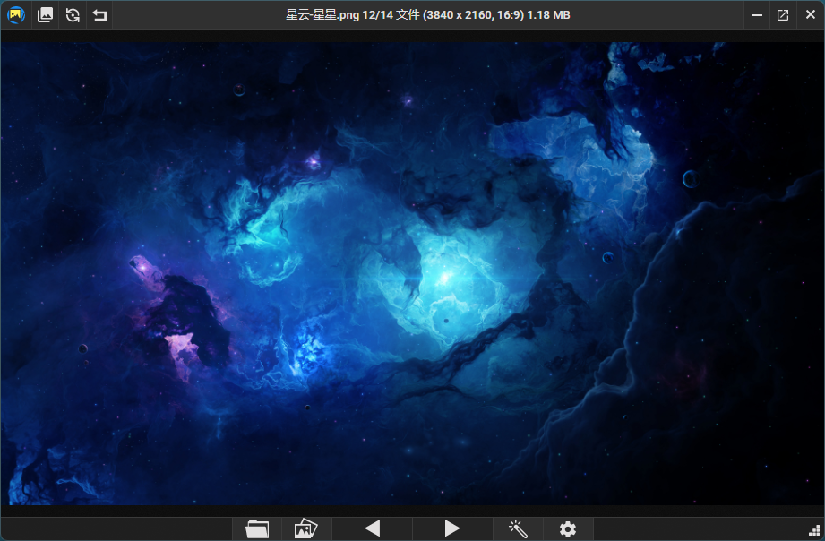

## 软件简介

PicView 是一款开源的图片浏览器，小巧、快速，支持查看压缩包图片，支持 Webp、psd、svg、RAW 等格式，便携、无广告，单可执行文件即开即用。

::: center



:::

::: center


:::

## 功能特性

- **开源免费无广告**：无需付费、无需会员，界面简约清爽！
- **跨平台支持**：从最初仅支持 Windows，现在官方也推出了 macOS 版，PicView 真正实现双系统兼容，不管你是 PC 党还是苹果党都能用它快速查看图片。
- **超快打开速度**：内置预加载器原理，让你快速顺畅浏览，即便是几十兆的大图也几乎秒开，切换图片时也几乎没有等待感。
- **支持几乎全部主流图片格式 (50+ 格式)**：包括 JPG、PNG、WEBP、GIF、SVG、PSD、HEIC、RAW 系列、JXL，甚至漫画压缩包格式（ZIP、RAR、CBR等，7Z 、RAR 需要安装 7-Zip 或 WinRAR 辅助），解决小众格式的图片查看难题。
- **极简无广告的 UI**：设计简洁，界面干净，不扰眼。按 `Alt` + `Z` 一键隐藏所有控制按钮，只显示纯图片。对纯粹看图需求的用户真的是福音。
- **方便的图片编辑功能**：旋转、水平翻转、裁剪，且支持批量调整大小、无损压缩，自动保持长宽比，省时省力。对图片进行滤镜调整，效果实时预览，轻松制作自己喜欢的风格。
- **图片信息一览无遗**：支持查看 EXIF 元数据，如拍摄时间、设备、GPS 定位，甚至还能一键跳转地图看拍摄地，方便摄影师管理照片。
- **色彩取色器**：标注喜欢的颜色，复制颜色代码，设计师的小帮手。
- **支持便携版和安装版**：便携版不占用安装空间，不修改注册表，适合放U盘带着走。安装版方便关联文件，一键打开。
- **27 种滤镜特效**：老照片、素描、胶片等效果可实时预览并导出
- **批量处理**：一键压缩/转换格式/生成缩略图，还能保持原始比例
- **丰富的快捷键支持**：操作顺手，效率加成。

## 支持格式

- .jpg .jpeg .jpe .png .bmp .tif .tiff .gif .ico .jfif .webp .svg .svgz
- .psd .psb .xcf .jxl .heic .heif .jp2 .hdr .tga .dds
- .3fr .arw .cr2 .cr3 .crw .dcr .dng .erf .kdc .mdc .mef .mos .mrw
- .nef .nrw .orf .pef .raf .raw .rw2 .srf .x3f
- .pgm .hdr .cut .exr .dib .emf .wmf .wpg .pcx .xbm .xpm .wbmp

## 系列文章



## 下载地址

::: download


:::

## 软件授权

:::


:::

## 开源协议

PicView 源码遵循 [GNU](https://github.com/Ruben2776/PicView?tab=License-1-ov-file) 协议进行分发和使用。
