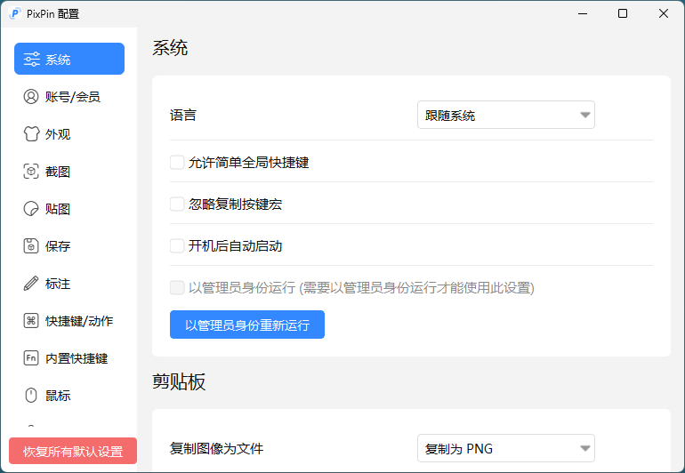

## 软件简介

PixPin 的名字来源于 "Pixel Pin"，简单来说是一个截图、贴图的工具，但是 PixPin 以截图和贴图两大功能为核心做了大量的优化功能，目标是提升用户在工作时的工作效率，无论用户使用电脑做何种工作，都可以使用 PixPin 提高工作效率。

{.cover}

::: center


:::

::: center


:::

## 功能特性

- **记录屏幕上的一切：** 在一个地方捕捉截图、录屏和长页面。
- **智能截图：** 通过智能自动检测和灵活选择工具，精确捕捉窗口、特定 UI 元素或全屏 - 完美适用于像素级文档和快速分享。
- **贴到屏幕：** 将图像、文本、颜色和文件像便签一样贴到屏幕上，随时提供即时参考，激发您的创造力。
- **从图像中提取文本：** 直接从 PixPin 便签中选择并复制文本，或在截图时即时提取文本。快速、简单、准确 - 告别手动重打！
- **标注：** 标注您的截图和贴图便签，清晰表达您的想法。圈出区域，用标记突出重点，使用序号显示顺序，马赛克隐藏敏感信息等 - 轻松通过视觉传达您的意图。
- **快速贴图截图（会员功能）：** 需要快速的视觉便签？使用我们的全局鼠标功能，只需在任何软件中按 WIN + 拖动（左键）即可快速捕捉截图并将其像数字便签一样贴到屏幕上。轻松快捷！
- **动作录制（会员功能）：** 在录屏时记录您的按键和鼠标点击，为清晰的教程、软件演示和流程文档提供完美的指导 - 逐步引导观众。

## 系列文章



## 下载地址

::: download

:::

## 软件授权

:::

:::

:::

:::
