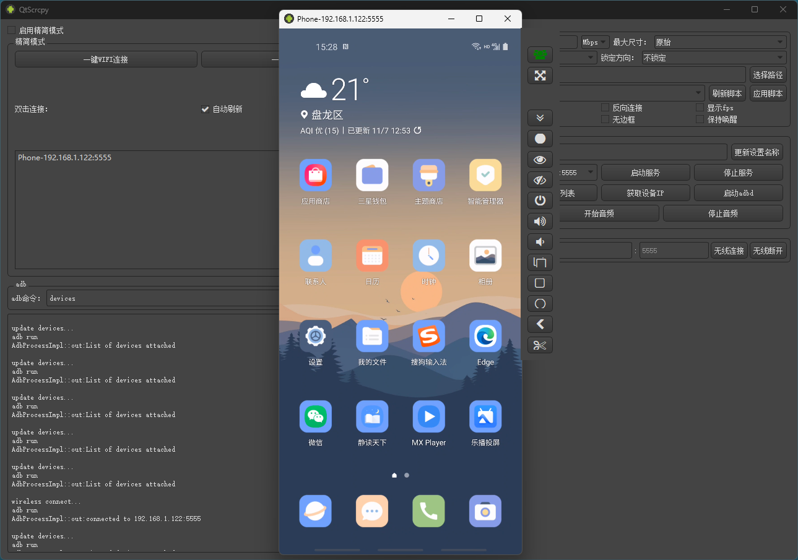

## 软件简介

QtScrcpy 是一款使用 Qt 框架开发的 Android 屏幕镜像和控制工具，它基于 scrcpy 的核心功能，但提供了更完善的图形界面和增强功能。

::: center


:::

::: center



:::

## 功能特性

### 核心功能

- **屏幕镜像：** 实时显示安卓设备屏幕
- **键鼠控制：** 使用电脑键盘鼠标操作手机
- **文件传输：** 在电脑和手机间拖拽传输文件
- **无线连接：** 支持 USB 和 WiFi 两种连接方式
- **多设备支持：** 同时控制多个安卓设备

### 特色功能

- **快捷键支持：** 自定义操作快捷键
- **屏幕录制：** 录制手机屏幕视频
- **截图功能：** 快速截取手机屏幕
- **分辨率调节：** 自定义显示分辨率
- **帧率设置：** 调节显示流畅度

## 安装使用

### 系统要求

- **电脑系统：** Windows 7+/macOS/Linux
- **安卓设备：** Android 5.0+
- **需要开启：** USB 调试模式

### 基本使用步骤

1. **下载安装：** 从 GitHub 发布页下载对应版本
2. **连接设备：** 通过 USB 数据线连接
3. **启用调试：** 在手机上允许 USB 调试
4. **启动连接：** 点击 QtScrcpy 的连接按钮

## 系列文章



## 下载地址

::: download


:::

## 软件授权

:::


:::

## 开源协议

QtScrcpy 源码遵循 [Apache-2.0](https://github.com/barry-ran/QtScrcpy?tab=Apache-2.0-1-ov-file) 协议进行分发和使用。
