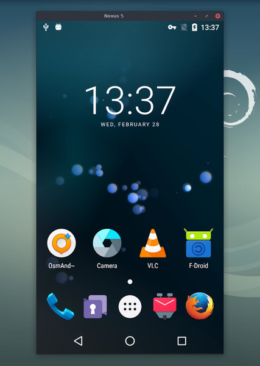

## 软件简介

Scrcpy 是一款开源的 Android 屏幕镜像和控制工具，由 Genymobile 开发。它可以通过 USB 或 WiFi 将 Android 设备的屏幕显示在电脑上，并允许使用键盘和鼠标进行控制。

::: center


:::

::: center



:::

## 功能特性

- **免费开源：** 完全免费，代码公开
- **高性能：** 低延迟，高帧率（最高可达 60fps）
- **高质量：** 支持 1080p 或更高分辨率
- **无需 Root：** 大多数 Android 设备可直接使用
- **跨平台：** 支持 Windows、macOS、Linux

## 系列文章



## 下载地址

::: download



:::

## 软件授权

:::


:::

## 开源协议

Scrcpy 源码遵循 [Apache-2.0](https://github.com/Genymobile/scrcpy?tab=Apache-2.0-1-ov-file) 协议进行分发和使用。
