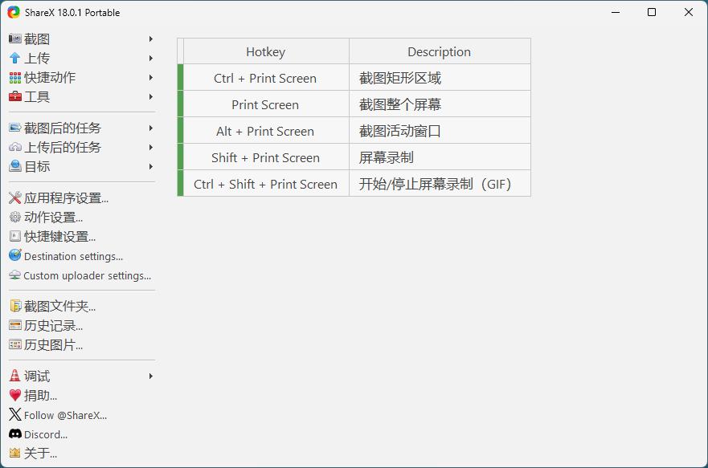

## 软件简介

ShareX 的功能相当全面，截图、录屏、加水印、裁剪、缩放、标注、涂鸦、上传全都能搞定！大多同类工具在完成截图后，一般都只是将图片保存到电脑硬盘上，之后更多的处理 (如裁剪大小、加水印、上传到图床等) 都需要使用第三方工具或使用浏览器来实现。而 ShareX 最大的特点就是整合了众多的图像处理功能以及网络上传分享功能。

{.cover}

::: center



:::

::: center

:::

## 功能特性

### 广泛的捕捉能力

ShareX 远不止是简单的全屏或矩形截图。

- **区域：** 选择自定义矩形区域。
- **窗口：** 捕捉特定的应用程序窗口。
- **显示器：** 捕捉您多个显示器中的某一个。
- **滚动捕捉：** 其旗舰功能。可以自动滚动并捕捉长的网页、文档或聊天记录，合并成一张长的图片。
- **自由手绘：** 绘制任意形状进行捕捉。
- **上次区域：** 快速重新捕捉您刚才捕捉的相同区域。
- **屏幕录制：** 将选定区域或屏幕录制为 MP4 或 GIF 格式。
- **屏幕广播：** 将您的屏幕实时流式传输到一个 URL。

### 强大的内置工具

在您截图之后，一系列强大的工具便可供使用：

- **图片标注器：** 一个功能齐全的编辑器，可以添加箭头、文本、模糊、高亮、马赛克以及绘制形状。
- **图片效果：** 应用滤镜、调整颜色、添加边框等。
- **OCR（光学字符识别）：** 直接从您的截图中提取文本。
- **二维码生成器：** 从文本或 URL 创建二维码。
- **取色器：** 获取屏幕上任何像素的 HEX/RGB 值。
- **标尺：** 以像素为单位测量屏幕上的距离。
- **图片合并器：** 将多张图片拼接在一起。

### 无缝上传和分享

这正是 ShareX 中 "Share" 一词的真正体现。

- **目标菜单：** 您可以配置 ShareX 将您的捕捉内容上传到 **80 多个** 不同的目的地，包括：
  - **图片上传器：** Imgur、Dropbox、Google Drive、Flickr、Amazon S3
  - **文本上传器：** Pastebin、GitHub Gist
  - **文件上传器：** [File.io](https://file.io/)、您自己的 FTP/SFTP 服务器
- **URL 缩短器：** 使用 [bit.ly](https://bit.ly/)、[goo.gl](https://goo.gl/) 或您自己的域名等服务来缩短生成的链接。
- **自定义上传器：** 对于高级用户，您可以使用其 API 定义自己的上传目的地。

### 高度可定制的工作流程

您几乎可以自动化流程的每个方面。

- **热键：** 为每种捕捉方法和工具分配自定义键盘快捷键。
- **捕捉后任务：** 定义在捕捉*之后*发生什么。例如："上传图片，将 URL 复制到剪贴板，并保存本地副本。"
- **上传后任务：** 定义在上传*之后*发生什么。例如："缩短 URL 并将其复制到剪贴板。"

## 效果展示

::: left

:::

## 系列文章



## 下载地址

::: download


:::

## 软件授权

:::


:::

## 开源协议

ShareX 源码遵循 [GPL-3.0](https://github.com/ShareX/ShareX?tab=GPL-3.0-1-ov-file) 协议进行分发和使用。
