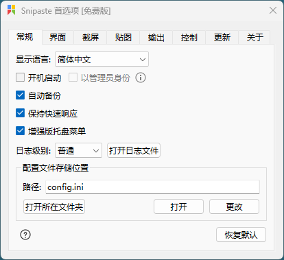

## 软件简介

Snipaste 是一个简单但强大的截图工具，也可以让你将截图贴回到屏幕上！下载并打开 Snipaste，按下 F1 来开始截图，再按 F3，截图就在桌面置顶显示了。就这么简单！

你还可以将剪贴板里的文字或者颜色信息转化为图片窗口，并且将它们进行缩放、旋转、翻转、设为半透明，甚至让鼠标能穿透它们！如果你是程序员、设计师，或者是大部分工作时间都在电脑前，贴图功能将改变你的工作方式、提升工作效率。

Snipaste 使用很简单，但同时也有一些较高级的用法可以进一步提升你的工作效率。感兴趣的话，请抽空读一读用户手册。

Snipaste 是免费软件，它也很安全，没有广告、不会扫描你的硬盘、更不会上传用户数据，它只做它应该做的事。

::: center


:::

::: center



:::

## 功能特性

### 强大的截图

- 自动检测界面元素区域
- 像素级的鼠标移动控制、截图范围控制
- 取色器
- 历史记录回放
- 支持多屏
- 支持高分屏

### 把图片作为窗口置顶显示

- 支持将剪贴板中的图像、纯文本、HTML、颜色信息、图像文件等内容转为图片
- 图片窗口支持缩放、旋转、镜像翻转、设置透明度、鼠标穿透、缩略图、图像标注、隐藏等操作
- 取色
- 文件拖放
- 贴图分组
- 自动备份、恢复

### 方便地标注图像

- 丰富的画图工具：矩形、椭圆、线条、箭头、铅笔、马克笔、文字
- 高级标注工具：马赛克、高斯模糊、橡皮擦
- 撤销、重做

### 自定义设置

- 主题色、界面字体、通知栏图标等
- 快捷键
- 丰富的功能性选项

## 系列文章



## 下载地址

::: download

:::

## 软件授权

:::

:::

:::

:::
