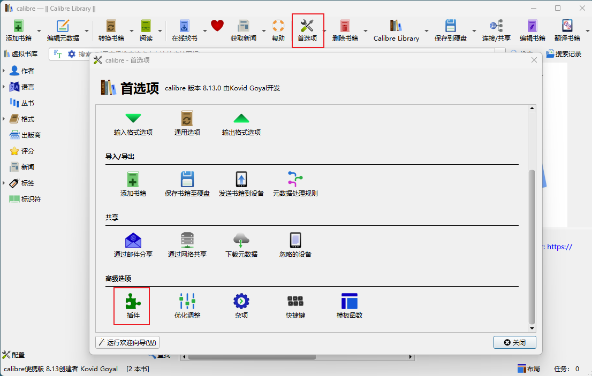
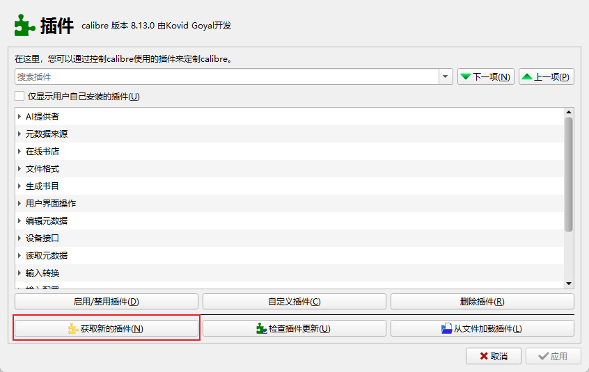
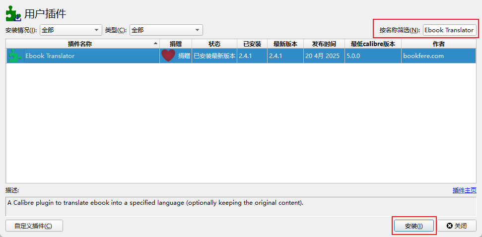
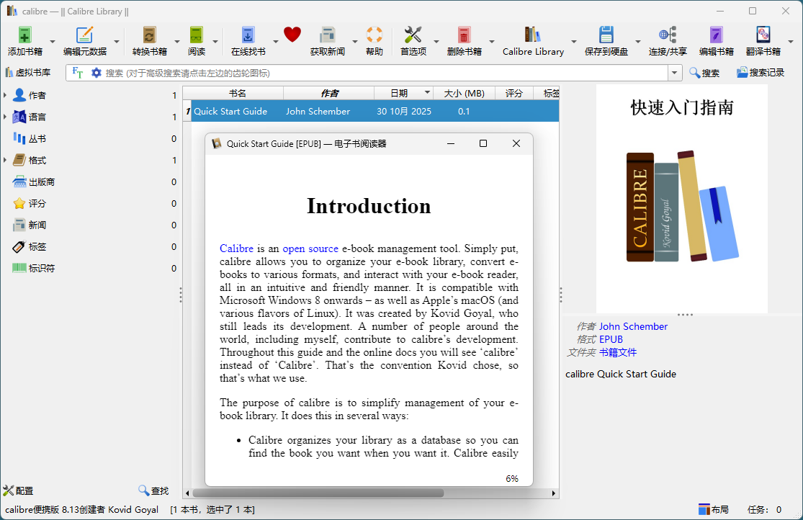
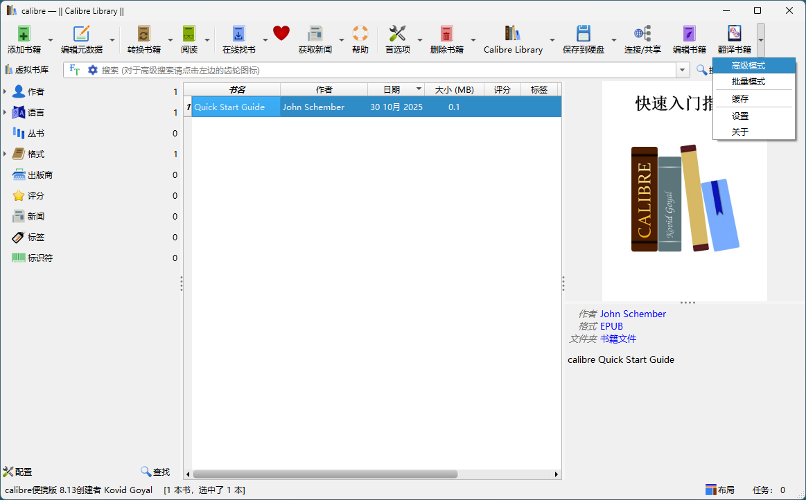
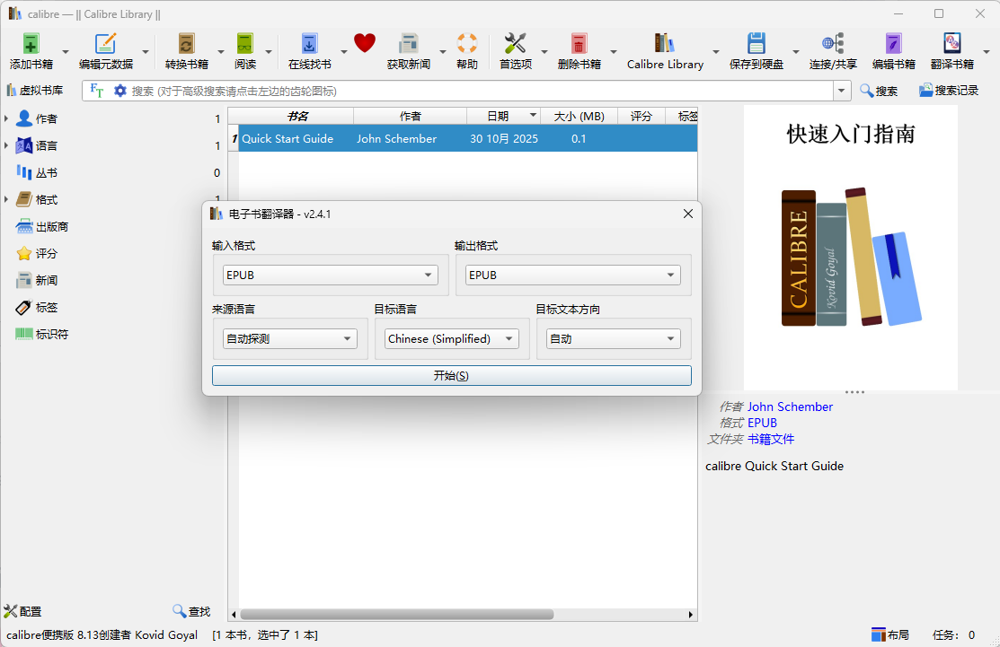
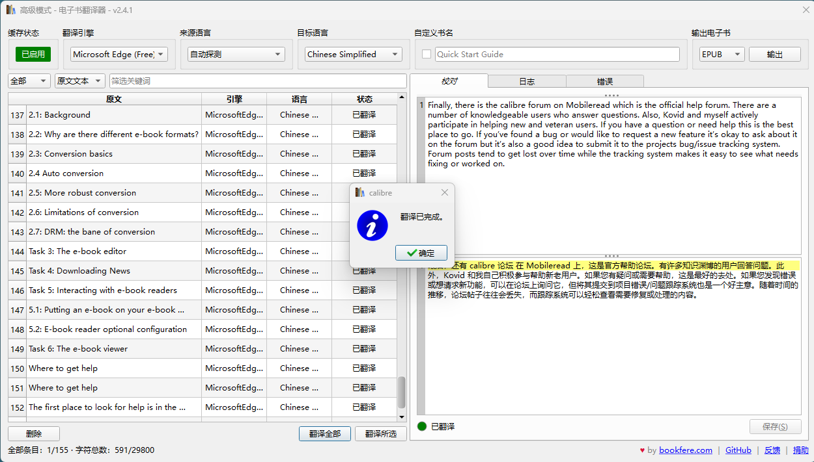
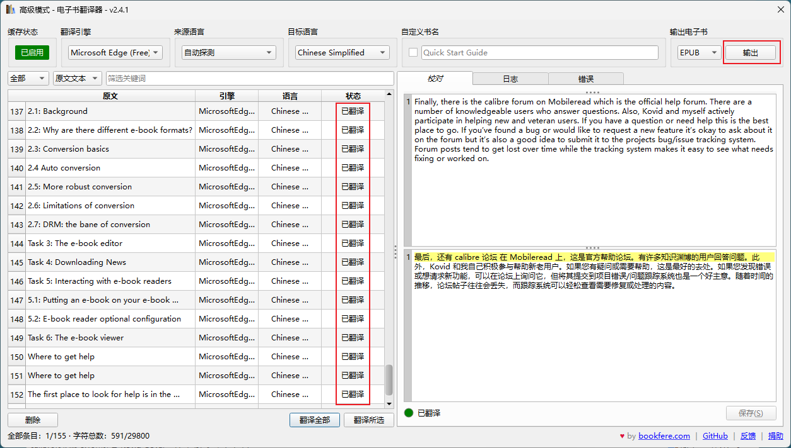
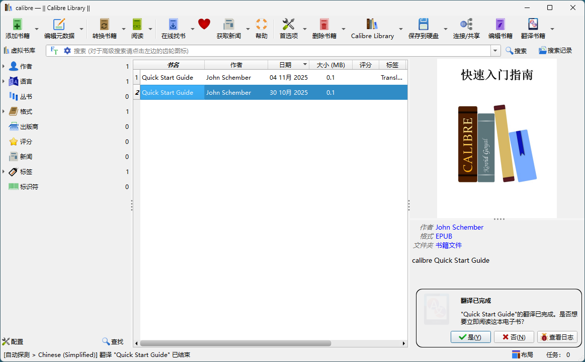
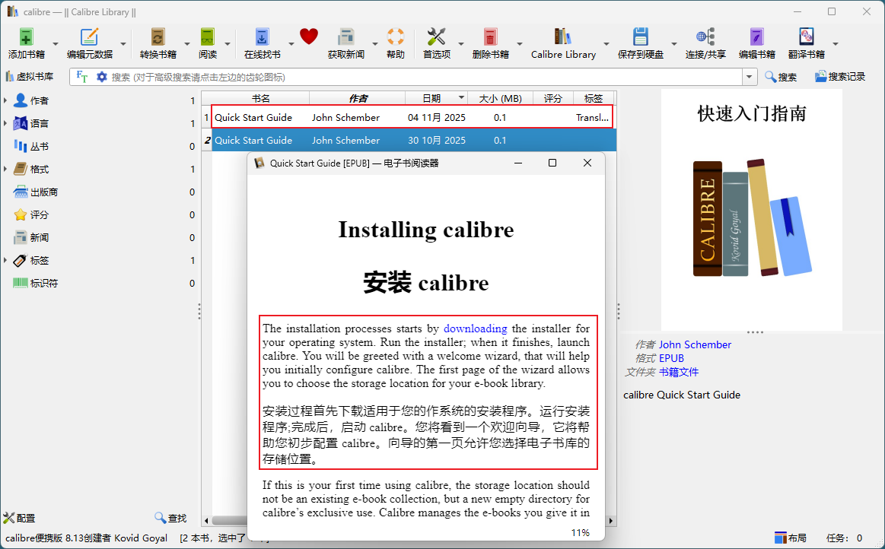

使用 calibre + Ebook Translator 插件可以实现免费整本翻译。

## 下载安装 Calibre

1. [Calibre 官方下载](https://calibre-ebook.com/download)
2. [Calibre 新手入门](https://calibre-ebook.com/zh_CN/help)
3. [Calibre 用户手册](https://manual.calibre-ebook.com/zh_CN/)

## 添加 `Ebook Translator`

打开 Calibre 主界面：工具栏 > 首选项 > 高级选项 > 插件  

首选项 - 插件窗口：获取新的插件  

用户插件窗口：查询 `Ebook Translator` 插件，并安装

## 翻译全书

以 `Quick Start Guide` 为例，翻译整本书籍

选中书箱，点击工具栏：翻译书籍- 高级模式，检查配置，点击开始

选择翻译引擎，点击翻译全部，确认翻译完成，点击输出。

点击输出后跳转至主窗口：

