**什么是 FolderHost ？**

> FolderHost 是一个轻量级的自托管私有云平台。它可以帮助用户在单个可执行文件中搭建完整的文件管理和协作系统，无需复杂的依赖和配置。具备许多功能，如文件管理、用户管理、实时协作、恢复箱、日志等。但目前它还不是为移动设备设计的。

## 主要特点

- **单二进制部署**：无需安装 PHP、数据库等依赖，一个可执行文件即可运行，Windows/Linux 仅约 19MB

- **实时协作编辑**：内置 Monaco Editor，支持多人实时协作编辑代码文件- **多用户权限管理**：完整的用户权限系统，支持细粒度的权限控制（读取、上传、删除、下载等）- **文件管理功能**：支持文件上传、下载、移动、复制、重命名等完整操作，支持大文件分块上传- **回收站功能**：删除的文件进入回收站，可配置存储上限，避免误删导致数据丢失- **审计日志**：记录所有用户活动，支持自动清理日志- **JWT 安全认证**：基于 JWT 的安全认证机制，Token 有效期 24 小时，绑定登录 IP 和 User-Agent- **开源免费**：基于 GPL-3.0 协议开源，可免费使用和修改

## 应用场景

- **个人文件存储**：搭建个人私有云，随时随地访问自己的文件

- **团队协作**：小团队共享文件和实时协作编辑代码

- **开发测试**：开发人员快速搭建文件共享测试环境

- **家庭 NAS 替代**：轻量级的 NAS 解决方案，适合家庭用户

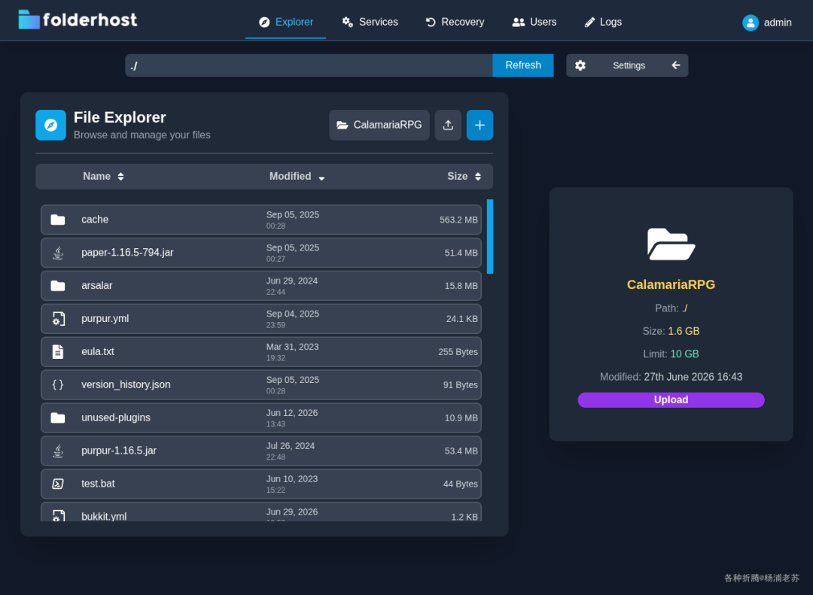
FolderHost 是一个轻量级的私有云平台，特别适合不想折腾 Nextcloud 复杂配置的用户。

## 安装

在群晖上以 Docker 方式安装。

在注册表中搜索 folderhost，选择第一个 mertjsx/folderhost，版本选择 latest。

> 本文写作时，latest 版本对应为 v26.6.2；

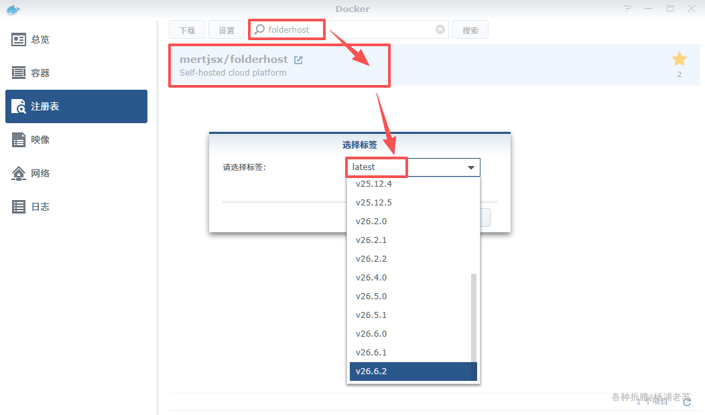
采用 docker-compose 安装，将下面的内容保存为 docker-compose.yml 文件

```bash
version: '3.8'

services:
  folderhost:
    image: mertjsx/folderhost:latest
    container_name: folderhost-server
    restart: unless-stopped
    ports:
      - "5400:5000"
    volumes:
      - folderhost_data:/app

volumes:
  folderhost_data:
    driver: local
    driver_opts:
      type: 'none'
      o: 'bind'
      device: '/volume1/docker/folderhost/data'
```

然后通过 SSH 登录到您的群晖，执行下面的命令：

```bash
# 新建文件夹 folderhost 和子目录
mkdir -p /volume1/docker/folderhost/data

# 进入 folderhost 目录
cd /volume1/docker/folderhost

# 将 docker-compose.yml 放入当前目录

# 一键启动
docker-compose up -d
```

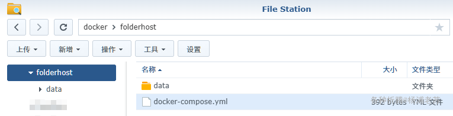

## 运行

在浏览器中访问 http://<群晖IP>:5400 即可进入登录界面

> 默认账号/密码： admin / 123

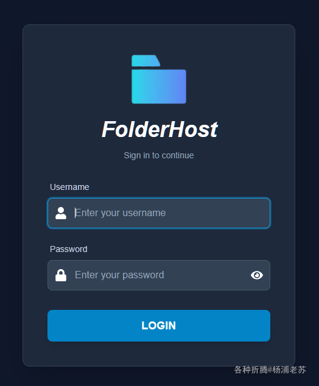
登录成功后

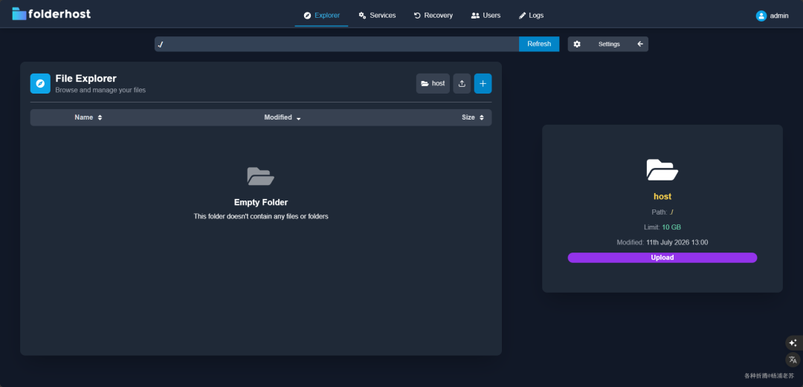
**重要提示**：首次运行后会在数据目录生成 config.yml 配置文件，可以通过修改配置文件来自定义设置

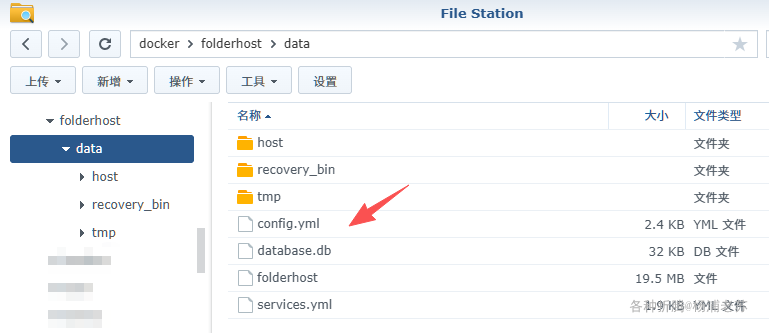
但不能直接编辑

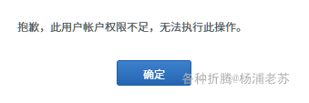
需要给文件增加 EveryOne 的读写权限

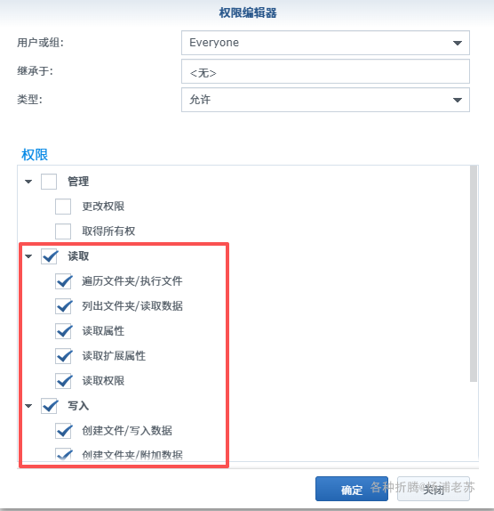
然后再编辑，但是切记！修改后需要重启容器才能生效

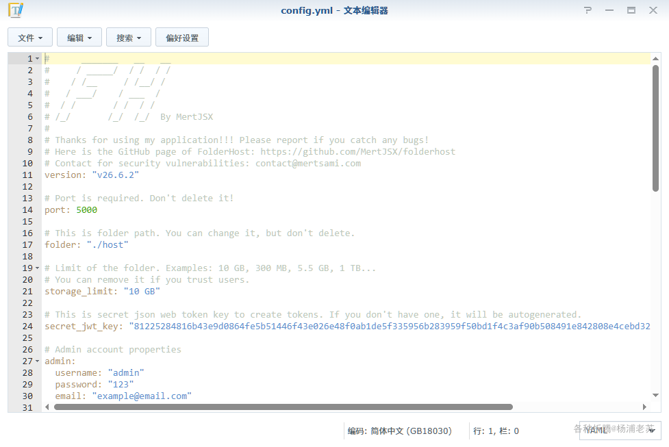
点 Upload 上传文件

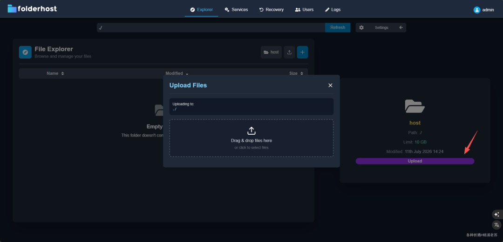
可以做删除、编辑等操作

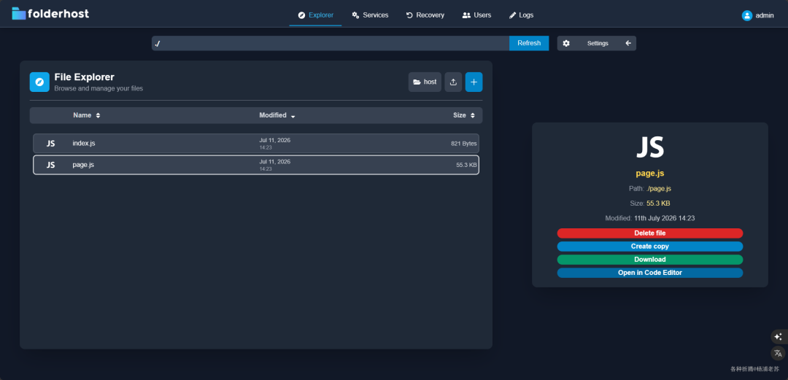
代码文件可以在 Code Editor 中打开，还能支持多人同时编辑

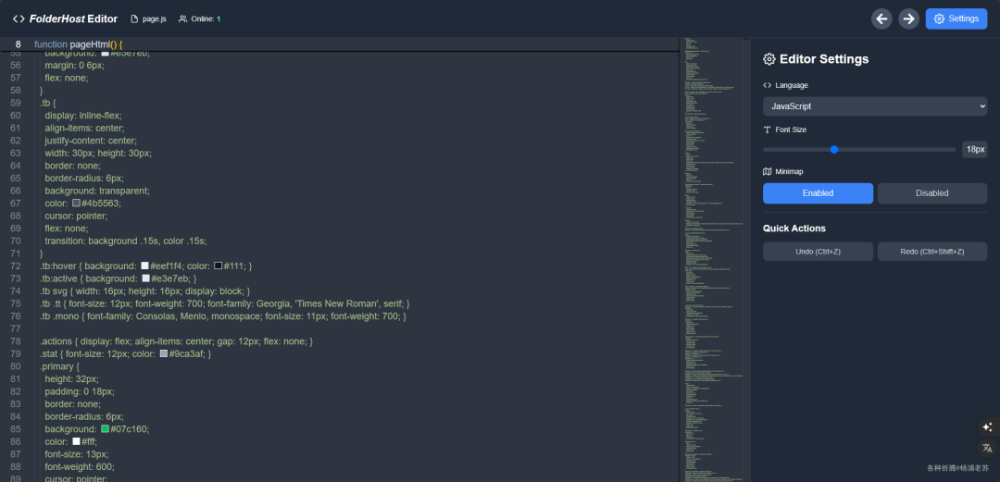

## 注意事项

- **修改默认密码**：默认管理员密码为 123，登录后请立即修改，避免安全风险

- **配置文件管理**：所有配置通过 config.yml 文件管理，修改后需要重启容器生效- **存储限制**：默认存储限制为 10GB，可在配置文件中调整或移除限制

- **JWT 安全机制**：Token 绑定登录 IP 和 User-Agent，换设备登录会导致原设备被登出

- **数据持久化**：确保将 /app 目录挂载到宿主机，否则容器重启后数据丢失

- **SSL 配置**：生产环境建议配置 SSL，支持自签名证书和 Let's Encrypt

## 参考文档
>
> MertJSX/folderhost: Your own private cloud in one executable. Share files, collaborate on code, and manage users without complex setup.
地址：https://github.com/MertJSX/folderhost

FolderHost - Self-hosted cloud platform
地址：https://folderhost.org

mertjsx/folderhost - Docker Hub
地址：https://hub.docker.com/r/mertjsx/folderhost

---

> **引用信息**
>
> - 原文标题：轻量级自托管私有云平台FolderHost
> - 原文链接：https://mp.weixin.qq.com/s/Kw0EkrQk_lKYlbqRVKvCxA
> - 原文作者：杨浦老苏
> - 抓取日期：2026-08-28
