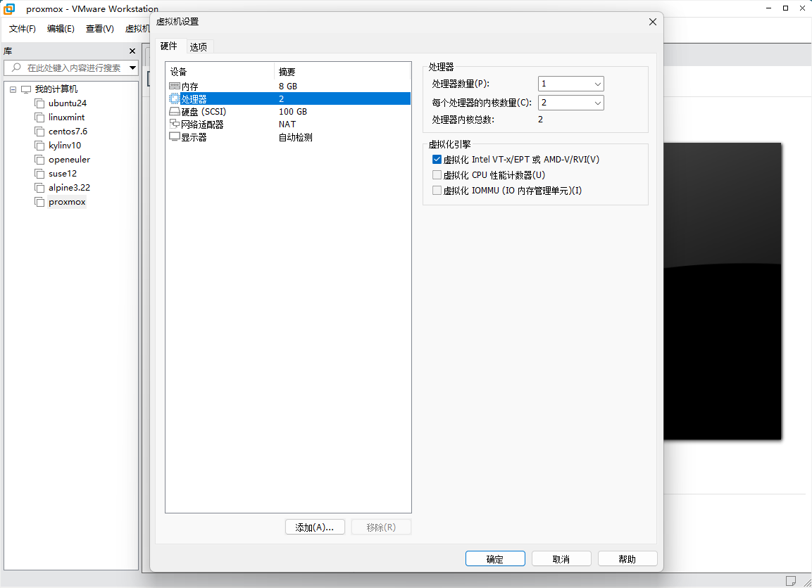
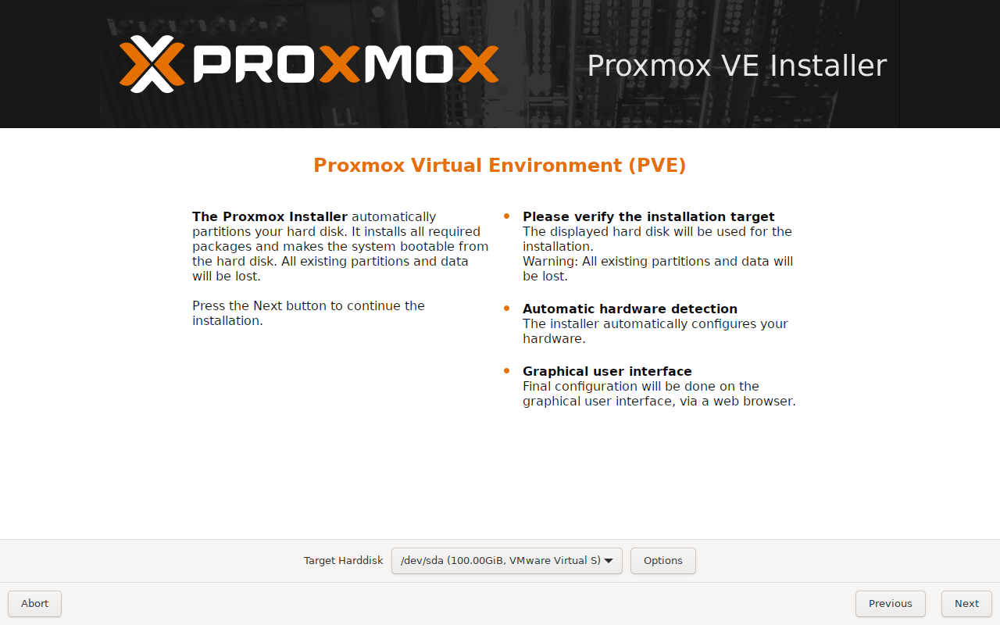
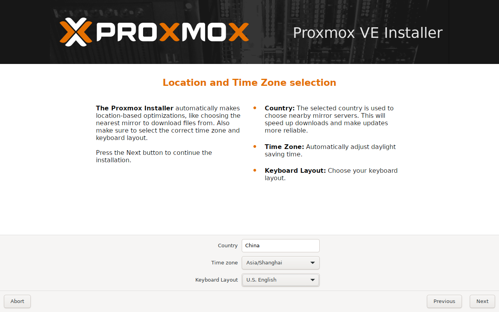
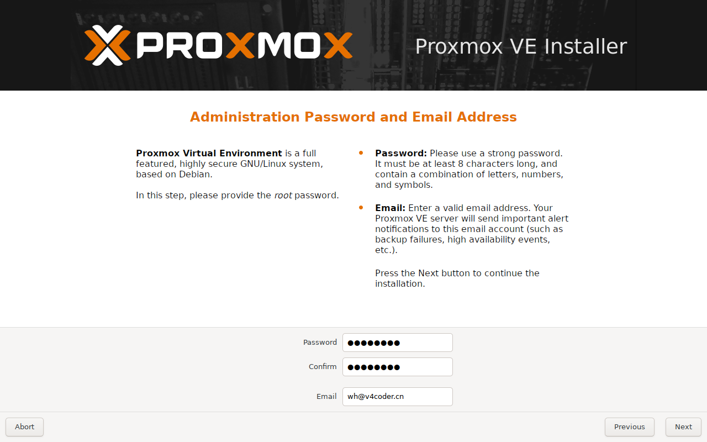
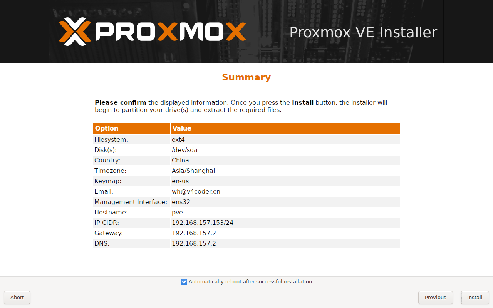
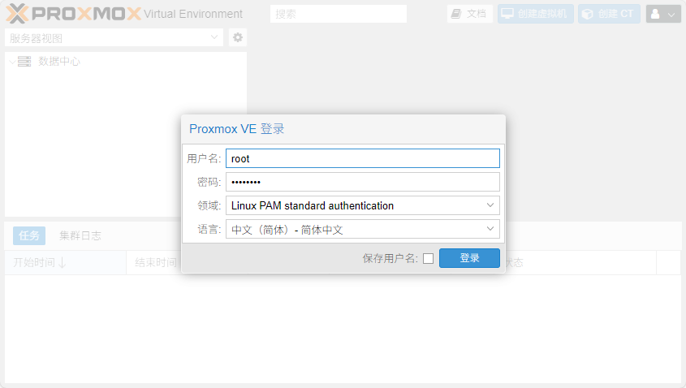
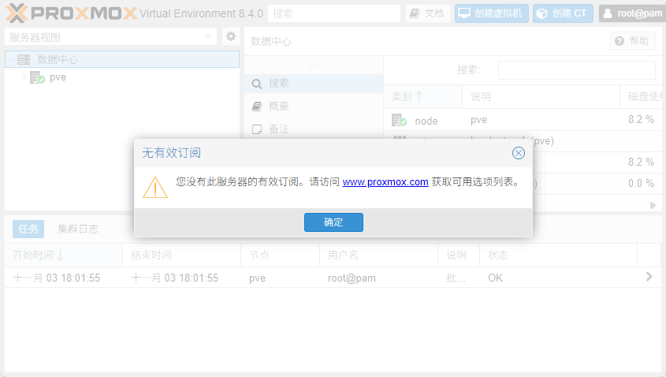

Proxmox Virtual Environment （简称 Proxmox VE 或 PVE） 是一个开源的虚拟化平台，结合了 KVM （Kernel-based Virtual Machine） 虚拟机和 LXC （Linux Containers） 容器技术。
它提供完整的网页管理界面，让您能轻松创建和管理虚拟机、容器、存储、网络等资源。

## 系统需求

### 基本需求

- **CPU**：64 位处理器 （Intel 或 AMD），支持虚拟化技术 （Intel VT-x/AMD-V）
- **内存**：至少 2GB RAM （建议 8GB 以上）
- **存储空间**：至少 32GB （建议 120GB 以上，SSD 为佳）
- **网络**：至少一个网络口
- **安装媒体**：8GB 以上 USB 随身碟

### BIOS 设置检查

在安装前，请进入 BIOS 设置确认：

- **虚拟化技术已启用**：Intel VT-x/AMD-V
- **IOMMU 已启用**（如需 PCI 直通）：Intel VT-d/AMD-Vi

## 安装准备

### 下载 Proxmox VE

- 访问 [Proxmox 下载页面](https://www.proxmox.com/en/downloads)
- 选择最新版本的 ISO 映像档下载

### BIOS 设置检查

在安装前，请进入 BIOS 设置确认：

1. **虚拟化技术已启用**：Intel VT-x/AMD-V
2. **IOMMU 已启用**（如需 PCI 直通）：Intel VT-d/AMD-Vi



### 制作安装 USB

安装 ventoy 至你要的设备，找到你安装 Ventoy 的装置，把下载的 Proxmox VE iso 档直接放进去，这样就完成了。

- [Ventoy 使用指南](/posts/688aa4c2/)

### 网络规划

在安装前，准备以下网络信息：

- **IP 地址**：为 Proxmox 服务器选择一个静态 IP（如 192.168.157.153）
- **子网络屏蔽**：通常是 255.255.255.0
- **默认网关**：您的路由器 IP（如 192.168.157.2）
- **DNS 服务器**：可使用 114.114.114.114 或您的路由器 IP
- **主机名**：为服务器选择一个名称（如 pve.v4coder.cn）

## 安装 Proxmox VE

### 启动安装程序

- 插入准备好的 USB 驱动器
- 重新启动计算机，进入开机菜单（通常按 F12， F11， 或 ESC 键）
- 选择从 USB 开机
- 在 Ventoy 开机菜单选择 proxmox ve.iso 文件
- 在 Proxmox 启动菜单中选择 "Install Proxmox VE"
- 等待系统加载

### 安装步骤

1. 接受授权条款

   - 阅读授权条款
   - 勾选「I accept the terms of the EULA」
   - 点击「Next」

2. 选择目标硬盘

   - 从下拉菜单选择要安装的目标硬盘
   - 选择文件系统：
     - **初学者建议**：选择 ext4
     - **高级用户**：如果有多颗硬盘可考虑 ZFS 选项
   - 点击「Next」

   

3. 设定位置与时间

   - 选择您的国家、时区和键盘配置
   - 点击「Next」

   

4. 设置管理员密码

   - 输入管理器（root）密码（至少 5 个字符）
   - 再次输入密码确认
   - 输入管理员电子邮件地址
   - 点击「Next」

   

5. 设定网络

   - 输入主机名（如 pve.v4coder.cn）
   - 选择网络接口（通常自动选择第一张网卡）
   - **IP 设置**：选择"静态"（Static）
   - 输入之前规划的 IP 地址
   - 输入子网掩码（通常是 255.255.255.0）
   - 输入网关IP
   - 输入 DNS 服务器
   - 点击「Next」

   

6. 确认安装

   - 检查安装摘要
   - 确认硬盘将被完全清除
   - 点击「Install」开始安装
   - 等待安装完成 （约 5-15 分钟）
   - 安装完成后点击「Reboot」

   

## 初始设定

### 首次登录 Proxmox

1. 在任何电脑的浏览器中输入：（例如 <https://192.168.153.157:8006>）
2. 忽略安全警告（点击 "高级" > "继续前往"）
3. 登录信息：
    - 用户名 ：`root`
    - 密码：安装时设定的密码
    - 领域 ：`Linux PAM standard authentication`
4. 点击 "登入"



### 删除订阅提示（可选）

初次使用会看到订阅提示，可依照以下步骤移除：

1. 通过 SSH 连接到 PVE：`ssh root@192.168.153.157`
2. 执行命令 ：

```sh
cd /usr/share/javascript/proxmox-widget-toolkit
cp proxmoxlib.js proxmoxlib.js.backup
sed -i "s/data.status !== 'Active'/false/g" proxmoxlib.js
systemctl restart pveproxy.service
```



### 初始系统更新

1. 在左侧菜单中选择「服务器」>「更新」
2. 点击重新整理检查更新
3. 点击升级安装所有更新
4. 或通过 SSH 运行：

```sh
apt update
apt dist-upgrade
```

### 添加 Proxmox 软件包库

添加 Proxmox 非商业使用软件包库。

1. 通过 SSH 编辑源列表：

    ```sh
    nano /etc/apt/sources.list
    ```

2. 添加下面这行（版本号根据您的实际版本调整）：

    ```sh
    deb http://download.proxmox.com/debian/pve bullseye pve-no-subscription
    ```

    > **注意**：请将 bullseye 替换为您的系统版本。

3. 保存并退出（Ctrl+O，然后 Ctrl+X）
4. 禁用企业套件库：

    ```sh
    rm /etc/apt/sources.list.d/pve-enterprise.list
    ```

5. 更新软件包 ：

    ```sh
    apt update
    ```
