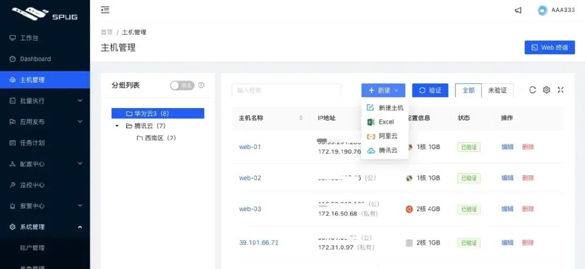
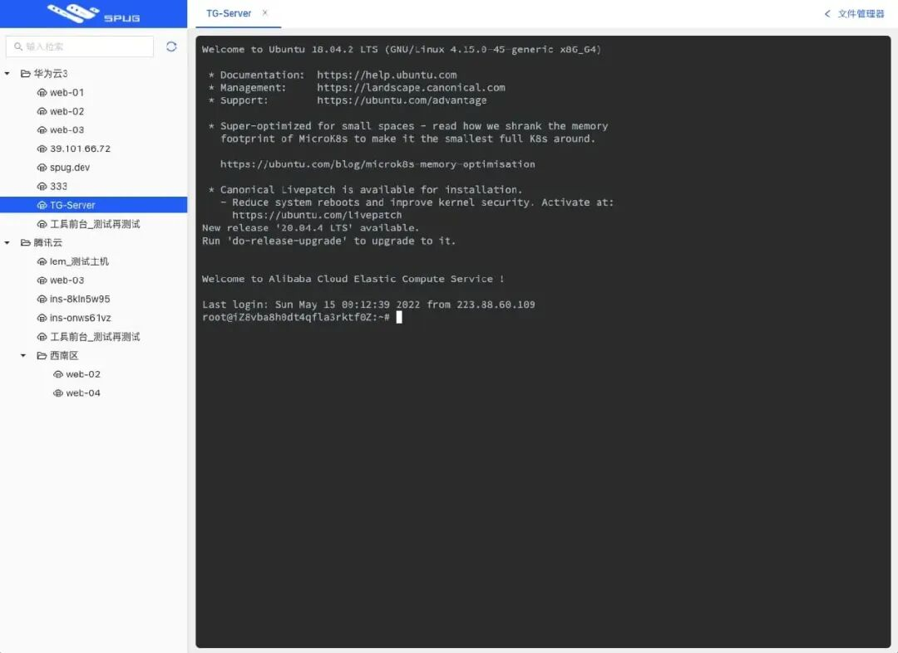
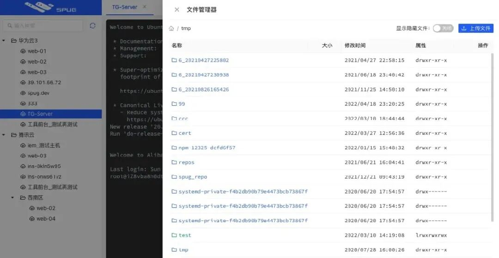
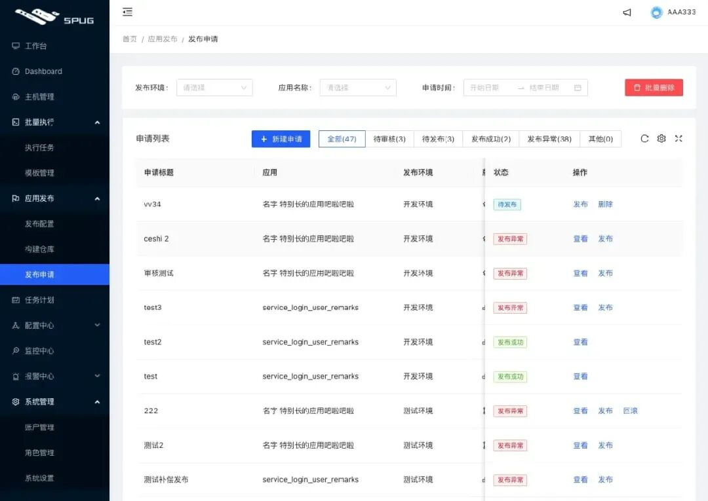
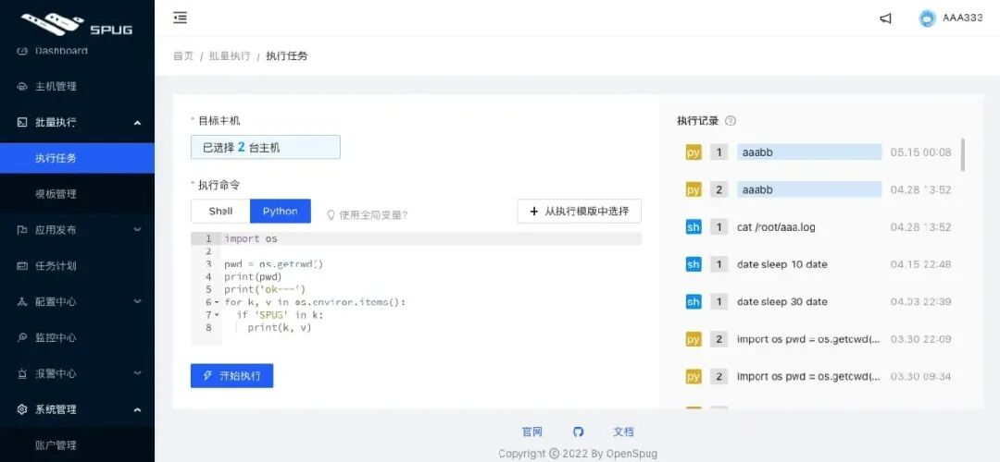
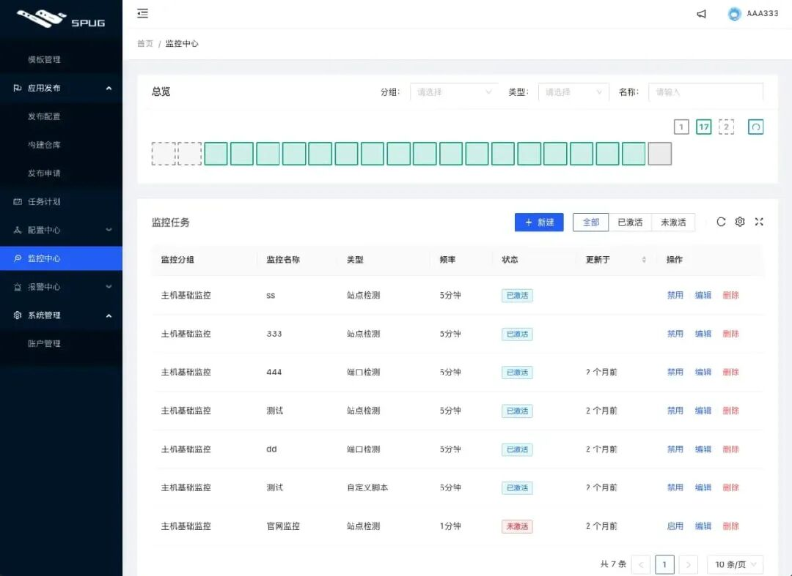

在很多中小型团队或初创公司中，运维工作往往停留在“半刀耕火种”阶段：

**批量操作全靠肉身**：改一个配置要挨个机器敲 SSH，几十台机器改到眼花

**代码发布全靠手搓**：拉代码、打包、杀进程、起服务全靠手动执行或者维护极其脆弱的 Shell 脚本

**权限与执行记录混乱**：谁在机器上执行了什么命令无法追溯，缺乏标准化的审批流

**Ansible 学习曲线陡峭**：想要落地自动化，但 YAML 语法与庞大概念让团队新人望而却步。

如果你的团队需要一套**轻量级、开箱即用、完全可视化**的自动化运维与持续部署系统，那么这款在 GitHub 狂揽 35k+ Star 的国产开源利器——**Spug**，绝对能让你相见恨晚。

## 什么是 Spug？

**Spug** 是一款专为中小型企业和团队打造的**开源轻量级自动化运维与持续交付平台**。

它采用免 Agent（Agentless）架构，只要目标主机支持 SSH 协议即可完成纳管，集成了**主机管理、批量执行、自动化发布、定时任务、监控告警**等运维核心场景，致力于帮助开发者与运维以极低门槛告别重复繁琐的人工作业。



## 为什么推荐它？五大核心功能

### 1. 免 Agent 主机纳管与 Web 终端

- 基于 SSH 协议直连，无需在目标服务器安装任何第三方 Agent 插件，轻量且无侵入。
- 内置安全的 Web 终端（支持多会话、分屏操作），支持在线文件管理器（上传、下载、修改文件一气呵成）。



### 2. 批量命令执行与文件分发

- 支持按“主机标签”或“主机组”一键批量执行 Shell/Python 脚本。
- 提供命令模板库与执行参数化，常用巡检、排错脚本一键复用，执行日志与输出结果实时回显。



### 3. 可视化应用发布（CI/CD）

- **多种发布模式**：支持常规构建发布、Git 代码检出发布以及自定义发布流。
- **发布流程控制**：内置发布前检查、代码检出、编译构建、停止旧服务、同步新包、启动新服务及发布后健康检查。
- **一键回滚**：历史版本留存与一键秒级回滚机制，发布失败不再手忙脚乱。



### 4. 分布式定时任务调度

- 告别散落在各台机器上黑盒一般的 `crontab`。
- 统一在 Web 页面配置定时任务（支持 Crontab 表达式），支持失败重试、超时中断、执行超时告警及运行日志统一归档。



### 5. 多渠道监控告警

- 内置站点检测、端口探测、主机基础资源（CPU/内存/磁盘）监控。
- 异常情况秒级推送至 **企业微信、飞书、钉钉、邮件** 等渠道。



## 极速安装与部署（Docker 一行命令）

Spug 官方提供了精简的单容器镜像，自带 SQLite 数据库，一分钟即可完成初始化：

```bash
# 极速拉起容器
docker run -d --name=spug --restart=always -p 80:80 -v spug-data:/data openspug/spug-service

# 初始化管理员账号（密码可自定义）
docker exec spug init_spug admin admin@spug.cc 123456
```

### 访问使用

- 浏览器打开 `http://<服务器IP>`；
- 输入初始账号 `admin` 和密码 `123456` 即可进入管理后台；
- 在 **主机管理** 导入服务器 SSH 密钥，即可开始配置批量发布与任务流！

## 选型与适用场景建议

| 适用团队 / 场景 | 推荐度 | 评价与建议 |
| --- | --- | --- |
| 初创团队 / 50台以内主机 | 推荐度极高 | 绝佳方案！免去 Jenkins + Ansible 复杂组合的维护负担，单面板搞定日常发布与运维 |
| 超大型多云 / 混合云集群 | 推荐度中等 | 大规模复杂流水线建议配合 GitLab CI / Jenkins 与 Kubernetes 体系使用 |

自动化运维的目的不是追求架构的炫技，而是**用最低的维护成本换取最高的交付效率与系统稳定性**。

Spug 恰好处在一个极佳的平衡点上——足够简单、足够全面、开箱即用。如果你还在用人肉脚本打补丁，赶快去部署一套体验一下吧！

- **GitHub 项目**：`/openspug/spug`
- **开源协议**：AGPL-3.0
- **Star 数量**：35,000+
- **技术底座**：Python (Django) + React + Ant Design

你们团队目前的代码发布流程是怎样的？

是 Jenkins、GitLab CI 还是直接在机器上手动拉代码？

欢迎在评论区分享你的发布实践！

> 作者: 阿浮
> 来源: https://mp.weixin.qq.com/s/yrcaqJrF248P7s0vzy-nlg
