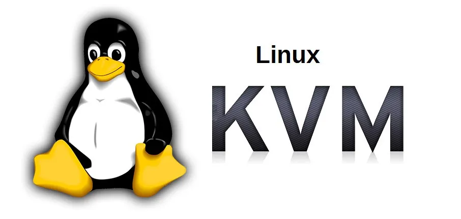
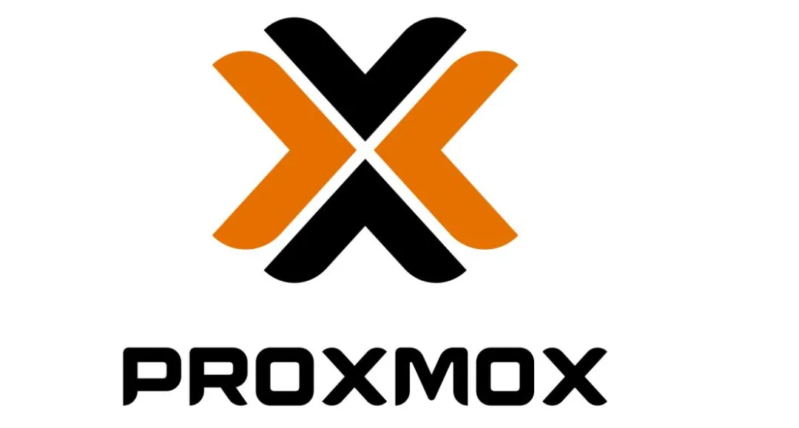
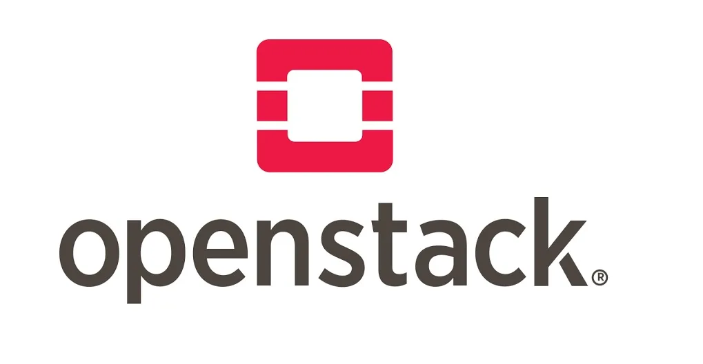

VMware 作为虚拟化行业的龙头企业，旗下的 vSphere 、vCenter 等产品一直是行业的顶流，以功能强大、性能稳定著称。但与此同时，其高昂的费用对于不少企业而言都是一笔不小的成本。

本文将为你介绍四款开源的虚拟化方案， 可以让你替代 Vmware 产品，从而实现企业 IT 成本的大幅下降。

## KVM

KVM 的全称是基于内核的虚拟机。它不是一个独立的应用程序，而是将 Linux 内核转变为一个裸机管理程序的模块。这意味着任何兼容的 Linux 系统（如 Ubuntu, CentOS, RHEL）在安装了 KVM 模块后，都可以直接运行虚拟机。

**主要特点：**

1. **高性能与原生集成：** 作为内核的一部分，KVM 能够直接调度 CPU 和内存，虚拟机指令无需经过软件转换，从而实现了接近物理机的性能。它需要 CPU 支持硬件虚拟化技术（如 Intel VT-x 或 AMD-V）。

2. **稳定性极高：** 得益于 Linux 内核的稳定性和广泛的硬件支持，KVM 本身非常稳定可靠，是众多云服务商（如 AWS、Google Cloud）的底层技术。

3. **灵活但需命令行：** KVM 的核心是 `libvirt` 工具集，用户可以通过 `virsh` 命令行工具或 `virt-manager` 图形界面来管理虚拟机。这为高级用户提供了极大的灵活性，但对于新手来说有一定学习门槛。

## Proxmox VE

Proxmox Virtual Environment（Proxmox VE）是一款开源的企业级虚拟化平台，专为提供高效便捷的服务器虚拟化和容器管理而设计。它基于 Debian，并提供了一个功能强大的Web管理界面，让用户可以通过浏览器轻松管理整个虚拟化环境。

**主要特点：**

1. **开箱即用：** 下载 ISO 镜像并安装后，您将获得一个包含 Web 管理界面、计算、网络和存储功能的完整虚拟化主机。

2. **融合虚拟化与容器：** 它不仅支持基于 KVM 的完整虚拟机，还原生支持 LXC 容器，允许您在轻量级容器中运行应用程序，实现更高的密度和更快的启动速度。

3. **强大的Web管理界面：** 其 Web 界面直观易用，包含了虚拟机创建、克隆备份、高可用性集群、网络配置等所有核心功能，极大地降低了使用门槛。

## oVirt

oVirt 是由 Red Hat 赞助的开源项目，它提供了一个用于管理整个 KVM 主机集群的中央管理平台。其架构与 VMware vCenter 非常相似，包含一个管理节点（oVirt Engine）和多个计算节点（KVM 主机）。

**主要特点：**

1. **集中式管理：** 通过单一的 Web 管理控制台，可以管理成百上千台 KVM 主机和数千台虚拟机，实现资源的统一调度和监控。

2. **高级企业功能：** 支持高可用性（HA）、动态负载均衡、实时迁移、电源管理等高级功能，完全满足企业级数据中心的需求。

3. **精细的权限控制：** 提供基于用户和角色的精细访问控制，可以与 Active Directory 等目录服务集成，符合企业 IT 管理规范。

4. **架构相对复杂：** 相比于 Proxmox VE，oVirt 的部署和配置更为复杂，通常需要专门的管理节点和数据库，更适合有一定规模的 IT 环境。

## OpenStack

OpenStack 不是一个单纯的虚拟化管理工具，而是一个由数十个相互关联的项目组成的庞大生态系统。它旨在通过 API 来提供按需分配的计算、存储和网络资源，其核心理念是 "云操作系统"。

**主要特点：**

1. **模块化与高度可扩展：** OpenStack 由多个独立服务组成（如 Nova-计算, Cinder-块存储, Neutron-网络, Glance-镜像等），每个服务都可以独立部署和扩展，能够支撑超大规模的基础设施。

2. **API驱动与自动化：** 一切操作都可通过 RESTful API 完成，使其成为自动化运维和与第三方系统集成的理想选择，是 DevOps 文化的完美载体。

3. **极其灵活与强大：** 提供了无与伦比的灵活性和控制力，可以构建出功能堪比 AWS、Azure 的私有云。

4. **部署和维护复杂：** 这是 OpenStack 最大的挑战。其复杂性非常高，通常需要一个专门的运维团队来部署、管理和维护。
