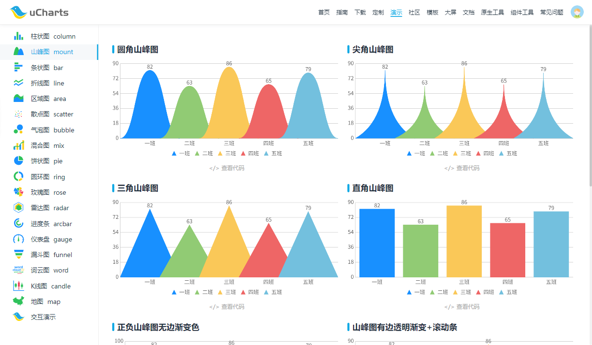

## 项目简介

UCharts 是一个基于 TypeScript 实现的类型丰富、高性能、模块化、可扩展、支持主题定制的跨平台图表库。底层渲染逻辑全部采用 TypeScript 实现，上层通过适配层（adapters）适配到不同平台，包括鸿蒙（HarmonyOS）、微信小程序、uniapp 等，真正实现 "一套核心，多端复用"。

{.cover}

::: center




:::

::: center





:::

## 技术特性

- **跨平台** 支持鸿蒙、微信小程序、uniapp 等主流平台

- **模块化设计** 底层渲染与平台适配解耦，易于扩展和维护

- ️ **TypeScript 全面支持** 类型安全，开发体验优秀

- **丰富图表类型** 柱状图、条状图、折线图、区域图、山峰图等

- **高性能渲染** 底层优化，动画流畅

- **易于扩展** 支持自定义图表类型和平台适配

- **自定义样式** 支持主题定制

## 效果展示

::: left

:::

## 系列文章



## 下载地址

::: download



:::

## 软件授权

:::


:::

## 开源协议

uCharts 源码遵循 [Apache-2.0](https://gitee.com/uCharts/uCharts) 协议进行分发和使用。
