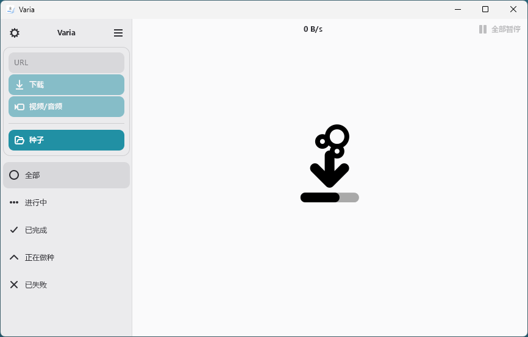

## 项目简介

Varia 是一个跨平台的下载管理器，支持 Linux 和 Windows 系统。它不仅能处理常规文件下载，还完美支持 torrents（种子下载）和视频/音频流提取。作为 aria2 和 yt-dlp 的前端界面，由 GitHub 用户 giantpinkrobots 于近期开源发布。

Varia 的核心价值是 **一站式管理所有下载需求**，让你摆脱浏览器内置下载器的局限性，避免文件散乱或速度瓶颈。如果你是个开发者、视频爱好者或重度下载用户，经常为 “多源下载慢” “种子管理乱” “视频提取麻烦” 烦恼，这个工具绝对值得一试。它体积小巧（Flatpak 版不到 100MB），界面简洁（基于 Gtk4 和 Libadwaita），上手快，支持浏览器扩展一键捕获链接。

::: center


:::

## 技术特性

1. **常规文件与 Torrent 下载**：支持多线程加速下载常规文件和 torrents，一键添加种子文件或磁力链接。相比浏览器，它能智能断点续传，避免“善忘”导致的重复下载。
1. **视频/音频流提取**：集成 yt-dlp，一键从 YouTube、Bilibili 等平台抓取视频/音频，支持格式转换（需 FFmpeg）。提取高清无水印，完美解决“视频下载乱码”痛点。
1. **浏览器集成与扩展**：Firefox 和 Chrome 扩展支持，一键将浏览器链接发送到 Varia。还内置 “下载完成后关机” 功能（Linux Snap 需额外权限），适合大文件批量处理。
1. **安全与性能**：数据本地优先，支持 DBus 集成（Linux）。测试中，在 i7 + 16GB 配置上，CPU 占用 <10%，内存友好。Flatpak 沙盒设计，提升安全性。

## 效果展示

::: left

:::

## 系列文章



## 下载地址

::: download



:::

## 软件授权

:::

:::

## 开源协议

Varia 源码遵循 [MPL-2.0](https://github.com/giantpinkrobots/varia?tab=MPL-2.0-1-ov-file) 协议进行分发和使用。
