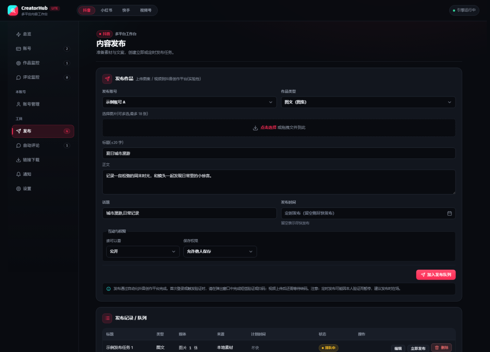
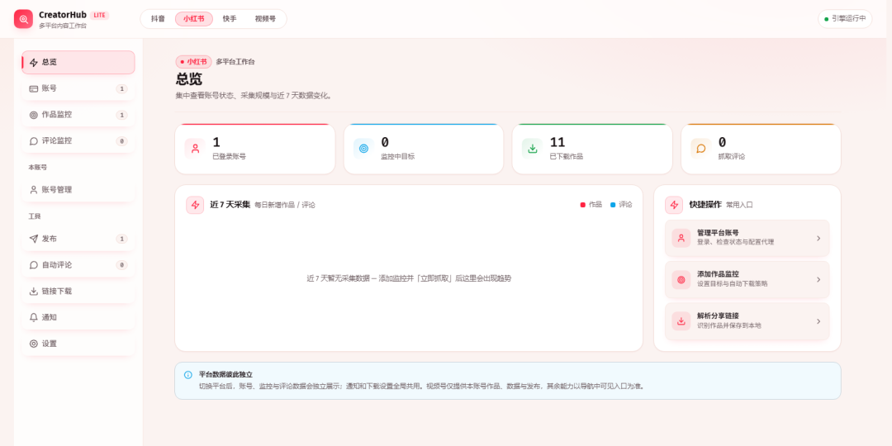
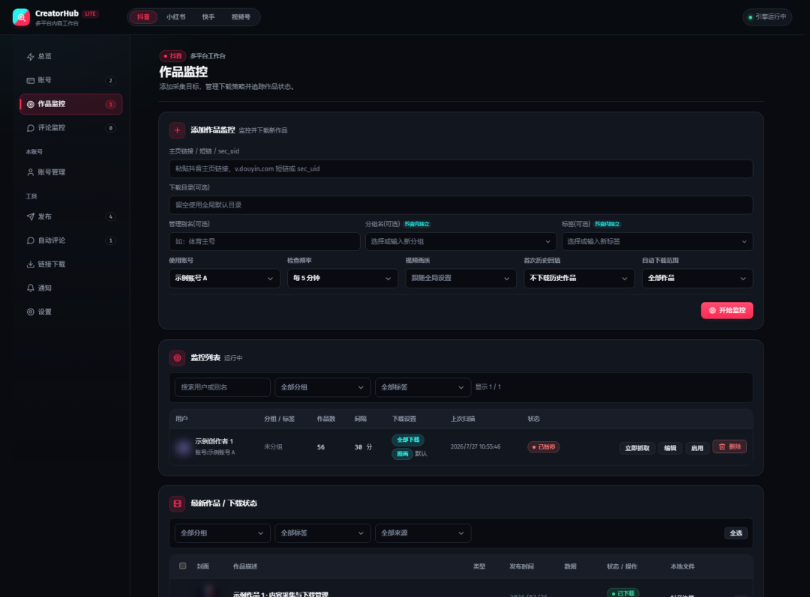
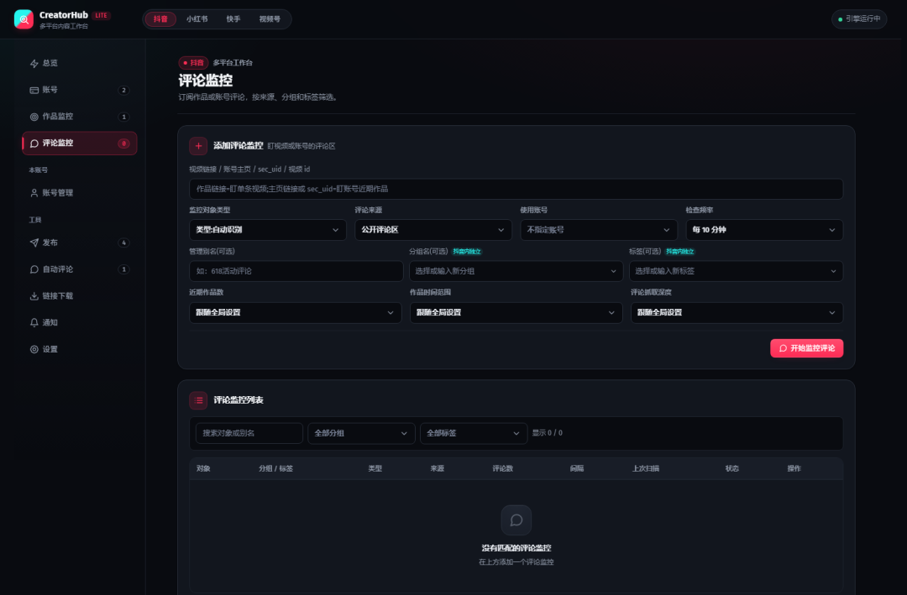
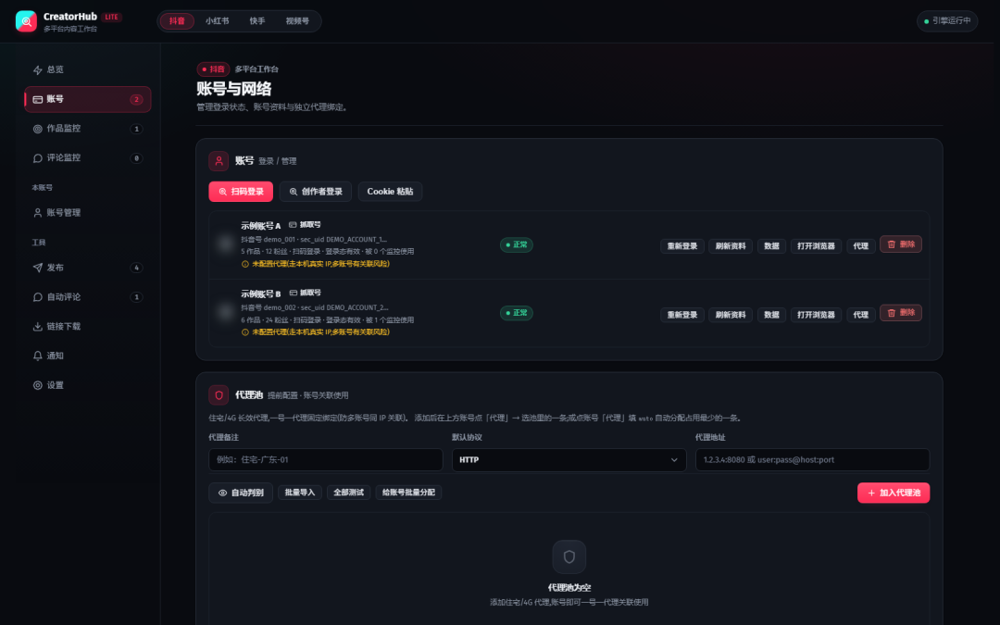

做自媒体矩阵、做竞品素材调研，经常要在抖音、小红书、快手来回跳转，多账号登录切换繁琐，素材下载、评论监控分散在各个平台。今天分享一款自托管开源 Web 面板 CreatorHub，把多平台账号、监控、采集、发布收拢在一个页面，不用订阅付费 SaaS，本地部署即可使用，非常适合开发者、技术向自媒体玩家。

## 一、项目基础档案

- 项目名称：CreatorHub
- 开源地址：<https://github.com/3441293738/creatorhub>
- 开源协议：MIT（可修改、可私有化，保留版权声明即可）
- 开发语言 & 技术栈：Python（FastAPI）+ Playwright，前端 TypeScript/React
- 适配系统：Windows、Linux（有桌面环境；无桌面服务器仅支持 Cookie 登录）
- 核心适用人群：技术向自媒体运营、独立开发者、个人站长、内容素材调研人员

项目部分截图：











## 二、核心功能亮点

### 1、多平台账号统一管理，账号环境隔离

**功能介绍**：支持抖音、小红书、快手，提供扫码、创作者后台、Cookie 导入多种登录方式；支持一号一代理绑定，浏览器配置文件独立存储。

**解决痛点**：多账号切换容易风控、环境互相污染，各个平台来回登录操作繁琐。

**使用价值**：一个面板维护全套账号，降低账号关联风险，顶部一键切换平台，数据互相隔离。

### 2、作品自动监控 + 断点续传下载

**功能介绍**：粘贴主页链接开启轮询监控新作品，支持自定义画质、存储目录，内置断点续传、失败重试机制，自动保存媒体文件到本地。

**解决痛点**：手动刷对标账号找新作，视频下载中断要重新跑，素材零散不好归档。

**使用价值**：自动盯对标账号产出，素材自动落盘，用于选题调研、个人作品本地备份。

### 3、独立评论监控，支持消息通知推送

**功能介绍**：可以监控单条作品或者整个账号全部作品的评论，支持对接 Bark、钉钉、Telegram 实现消息告警通知。

**解决痛点**：矩阵账号评论分散，错过重要用户留言，手动刷评论效率极低。

**使用价值**：不用蹲各个 App，新评论直接收到提醒，方便做竞品舆情、粉丝互动跟踪。

### 4、跨平台内容转发发布，AI 辅助内容优化

**功能介绍**：采集内容后可直接在面板完成跨平台发布，自带标题文案优化；可接入大模型，辅助生成回复、文案内容。

**解决痛点**：内容二次分发需要手动复制、重新剪辑标题文案，重复劳动多。

**使用价值**：一套素材快速分发多平台，减少重复复制粘贴工作。

### 5、模块化扩展，方便新增平台

**功能介绍**：平台逻辑做了子包模块化隔离，新增内容平台只需要新增对应子包即可扩展，二次开发门槛友好。

**解决痛点**：很多工具写死平台，想要新增平台只能改大量核心代码。

**使用价值**：懂 Python 的开发者，可以按需拓展自己需要的内容平台。

## 三、适用场景 & 适配人群

**适合使用**

1. 个人/小团队自媒体矩阵：多账号运营抖音、小红书、快手，希望统一管理。
2. 内容调研、竞品分析：持续监控对标账号作品、评论，做素材收集。
3. 本地作品备份：把自己账号全部作品、评论、私信归档到本地数据库。
4. 开发者、技术爱好者：自托管部署，二次开发定制自己的运营工具。

**不适合使用**

1. 完全零基础、不想做任何部署配置的普通用户，需要 Python 环境，无法开箱即用。
2. 希望直接拿来做大规模爬虫、批量营销，平台接口存在风控限制，滥用会导致账号风险。

## 四、实测体验 & 客观优缺点

上手难度：中等，需要基础 Python 环境知识；Windows 部署更简单，Linux 优先建议桌面环境，纯服务器只能 Cookie 登录。

**核心优势**

1. 完全开源免费，无订阅费，所有数据保存在自己本地，不经过第三方 SaaS 服务商。
2. 账号隔离、代理绑定、请求随机抖动，做了基础的风控规避设计。
3. 功能完整：登录 - 监控 - 下载 - 评论 - 发布 - 通知全链路打通。
4. 模块化架构，代码结构清晰，二次开发友好。

**现存不足**

1. 不是开箱即用产品，需要手动搭建 Python、Playwright 运行环境，配置 yaml 配置文件。
2. 纯无桌面 Linux 服务器，扫码登录不可用，只能手动粘贴 Cookie。
3. 第三方平台页面更新后，页面解析逻辑可能失效，需要等待项目更新适配。
4. 风险提示：自动化操作存在平台账号风控风险，仅供个人学习、自用备份，请勿用于违规批量营销。

## 五、极简快速上手教程

```bash
# 拉取项目代码
git clone https://github.com/3441293738/creatorhub
cd creatorhub

# Windows 激活虚拟环境
.\start.cmd

# Linux/macOS 激活
chmod +x start.sh
./start.sh
```

首次运行会自动创建虚拟环境、安装依赖和 Chromium、生成 config.yaml。

部署完成，浏览器打开访问：<http://localhost:8000> 即可进入 Web 面板。

提示：扫码登录会弹出真实浏览器窗口；云服务器无桌面，只能使用 Cookie 方式登录账号。

常用命令：

```bash
.\start.cmd install       # 重新安装或更新依赖
.\start.cmd check         # 环境自检
.\start.cmd --no-open     # 启动后不自动打开页面
.\start.cmd --port 8080   # 使用其他端口
.\start.cmd --reload      # 开发模式
```

## 全文总结

CreatorHub 是面向开发者的自托管多平台内容运营面板，免费开源，收拢抖音、小红书、快手的账号、监控、采集、发布能力。它不适合纯小白，但如果你懂基础部署，不想付费 SaaS、想要数据掌握在本地，做自媒体调研、账号备份可以试一试。务必注意合规，规避账号风控风险。

如果自建自媒体运营工具，你最希望优先实现哪个功能？欢迎评论区聊聊。

喜欢的话点击下方卡片关注一下我吧，为您推荐更多优秀好用的程序和软件。你也可以给我留言或私信，说出你需要的程序和软件，我帮大家推荐。

---

> 来源：[微信公众号 - 科技虫](https://mp.weixin.qq.com/s/TqckpSR5Tj3Z8Cf2Yp3TgA)
