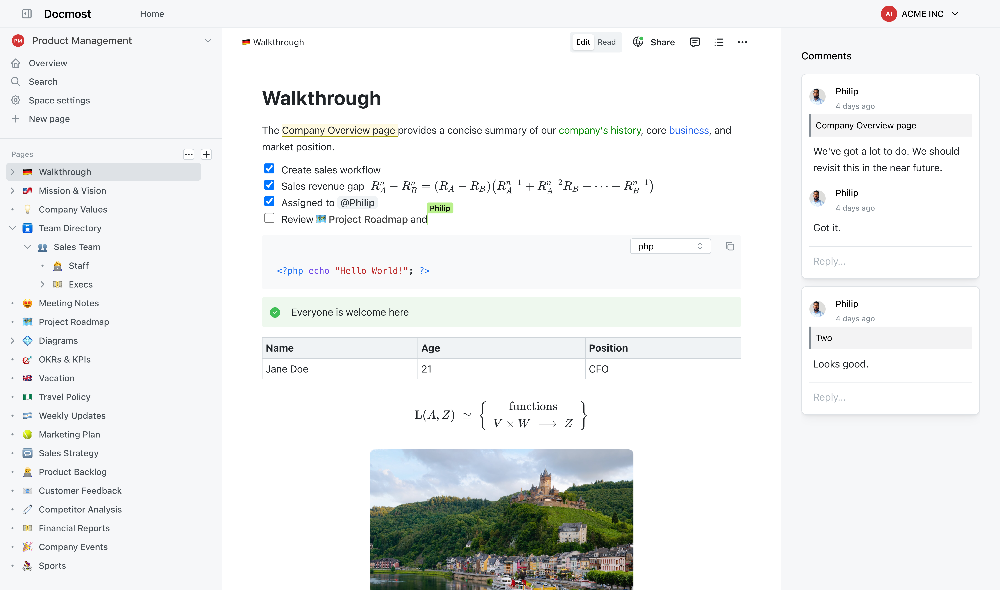

## 项目简介

Docmost 是一款开源的 团队协作 Wiki 与文档管理工具，定位为 Confluence 和 Notion 的开源替代品，专注于提供高效、安全且可定制的知识库解决方案。

{.cover}

::: center



:::

## 技术特性

- **实时协作编辑：** 支持多人同时编辑文档，类似 Google Docs 的实时同步机制，提供富文本编辑、Markdown语法、数学公式（LaTeX）、表格、标注等功能。
- **可视化绘图：** 内置 Draw.io（流程图）、Excalidraw（手绘草图）、Mermaid（图表渲染）等工具，用户可直接在文档中创建专业图表。
- **空间管理：** 可以为不同团队、项目或部门创建专属的空间，为协作提供结构化的集中环境。
- **权限管理：** 支持用户组管理，提供空间、页面、用户组多层权限管理。
- **评论系统：** 支持内联评论系统，便于团队在文档中直接讨论。
- **历史追溯：** 自动保存修改记录，支持差异对比与一键回滚，满足合规审计需求。
- **文件存储：** 通过复制粘贴快速上传文件、图像、视频等，支持 S3 或者本地存储。
- **全文检索：** 基于 PostgreSQL 语义搜索快速定位信息。
- **导入导出：** 支持导入 Markdown、HTML、Notion、Confluence（需要企业版）文件，支持导出 Markdown、HTML 文件（包括附件）。
- **公开共享：** 可以公开共享文档页面，允许任何知道链接的人员进行查看。
- **其他功能：** 可以嵌套 Airtable、Figma、Miro、Google Sheets 等，支持设置页面的编辑/只读模式，支持中文界面。

## 效果展示

::: left

:::

## 系列文章



## 软件授权

:::


:::

> 企业内使用需要遵守 [许可协议](https://docmost.com/enterprise-edition-license) 并获取商业授权。

## 开源协议

Docmost 源码遵循 [AGPL-3.0](https://github.com/docmost/docmost?tab=AGPL-3.0-1-ov-file) 协议进行分发和使用。
