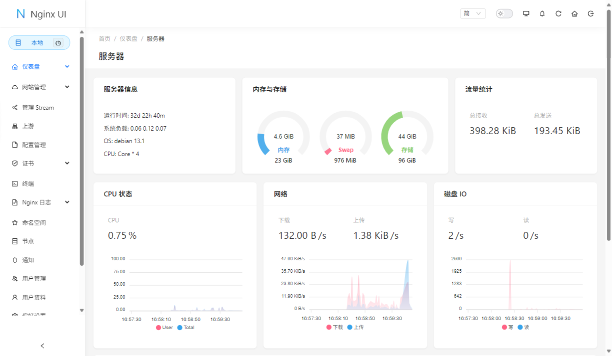

## 项目简介

Nginx UI 是一个全新的 Nginx 网络管理界面，旨在简化 Nginx 单机和集群节点的管理和配置。 它提供实时服务器运行数据、Nginx 性能监控、ChatGPT 助手、支持大模型代码补全的代码编辑器、 一键部署 Let's Encrypt 证书的自动续签以及用户友好的网站配置编辑工具。此外，Nginx UI 还提供了在线访问 Nginx 日志、配置文件的自动测试和重载、网络终端、深色模式和自适应网页设计等功能。 Nginx UI 采用 Go 和 Vue 构建，确保在管理 Nginx 服务器时提供无缝高效的体验。

{.cover}

::: center



:::

## 功能特性

- **在线统计**：提供服务器指标如 CPU 使用率、内存使用率、负载平均值和磁盘使用率的在线统计。
- **ChatGPT 助手**：内置 ChatGPT 助手，提供智能辅助功能。
- **一键部署和自动续期**：支持一键部署 Let's Encrypt 证书，并自动续期。
- **在线编辑配置**：在线编辑 Nginx 配置文件，编辑器支持 Nginx 配置语法高亮。
- **查看 Nginx 日志**：提供在线查看 Nginx 日志的功能。
- **自动测试和重载**：自动测试配置文件并在保存后重载 Nginx。
- **Web 终端**：提供 Web 终端访问功能。
- **暗色模式**：支持暗色模式，保护用户视力。
- **响应式网页设计**：确保在不同设备上都能良好显示。

## 效果展示

::: left

:::

- 账号：admin
- 密码：admin

## 软件授权

:::


:::

## 开源协议

Nginx UI 源码遵循 [AGPL-3.0](https://github.com/0xJacky/nginx-ui?tab=AGPL-3.0-1-ov-file) 协议进行分发和使用。
