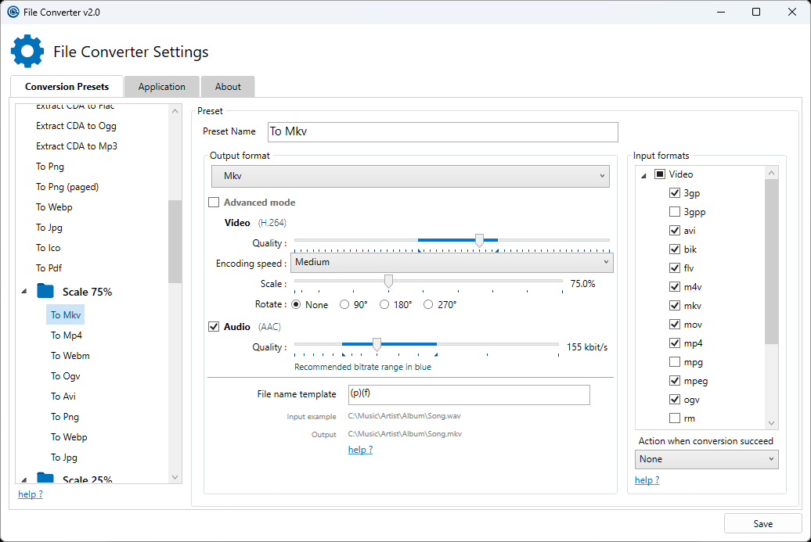

## 软件简介

File Converter 是一款完全免费且开源的 "万能格式转换工具"，支持 Vista/7/8 及最新的 Windows 10。它不仅支持多种格式，而且最大的特色就是，用户可以通过文件右键菜单快速进行文件格式转换，使用上效率非常高，可谓是装机必备利器。

::: center



:::

::: center

:::

## 功能特性

File Converter 支持转换的文件格式列表：

| 文件类别 | 支持转换成 | 兼容的输入格式 |
| --- |  --- |  --- |
| 音频文件 | flac, aac, ogg, mp3, wav | 3gp, aiff, ape, avi, bik, cda, flac, flv, m4a, mkv,  mov, mp3, mp4, oga, ogg, wav, webm, wma, wmv |
| 视频文件 | webm, mkv, mp4, ogv, avi, gif | 3gp, avi, bik, flv, gif, m4v, mkv,  mp4, mpeg, mov, ogv, webm, wmv |
| 图片文件 | png, jpg, ico, webp | bmp, exr, ico, jpg, jpeg, png, psd, svg, tiff, tga, webp, pdf,  doc*, docx*, odt*, odp*, ods*, ppt*, pptx*, xls*, xlsx* |
| 文档 | pdf | doc*, docx*, odt*, odp*, ods*, ppt*, pptx*, xls*, xlsx*,  bmp, exr, ico, jpg, jpeg, png, psd, svg, tiff, tga |

## 系列文章



## 下载地址

::: download


:::

## 软件授权

:::


:::

## 开源协议

File Converter 源码遵循 [GPL-3.0](https://github.com/Tichau/FileConverter?tab=GPL-3.0-1-ov-file) 协议进行分发和使用。
