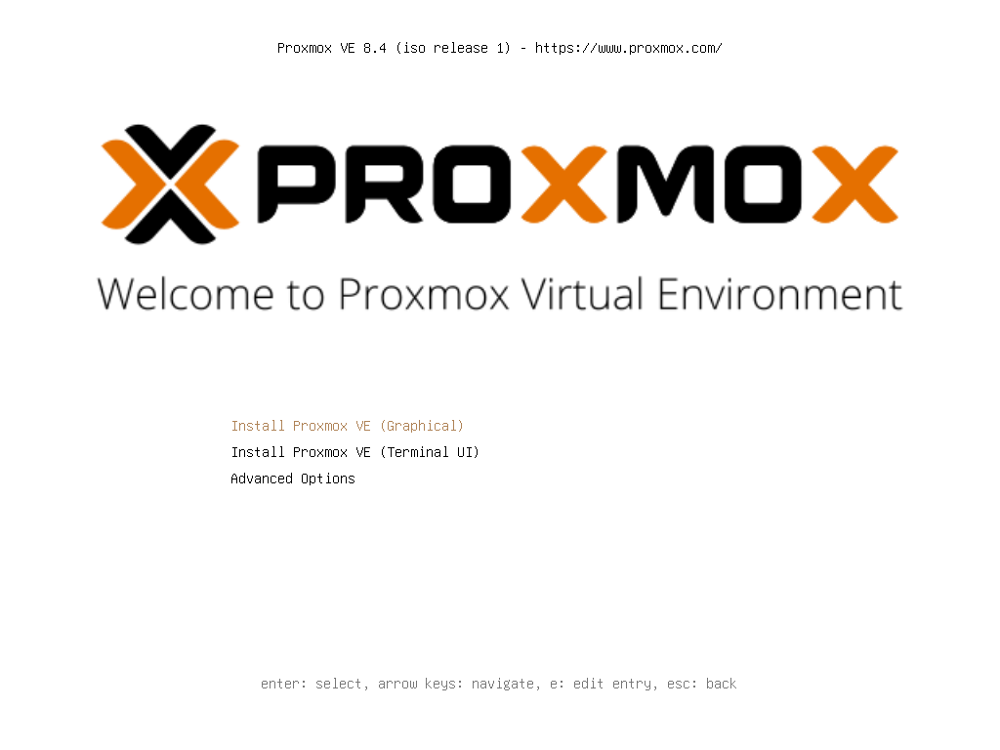

## 软件简介

Proxmox Virtual Environment (Proxmox VE) 是一个开源的虚拟化平台，基于 Debian Linux，支持 KVM 虚拟机和 LXC 容器。它提供了一个强大的 Web 管理界面，方便用户管理虚拟机、存储、网络等资源。Proxmox VE 广泛应用于企业级虚拟化、云计算和开发测试环境。

{.cover}

::: center




:::

::: center

:::

## 核心特性

### 集成的虚拟化与容器技术

- **KVM（内核虚拟机）** 用于运行全功能的虚拟机（VM），可以安装任何x86操作系统（如 Windows, Linux 等）。支持硬件直通，让虚拟机直接控制物理硬件（如 GPU、网卡），性能接近原生。
- **LXC（Linux 容器）** 一种轻量级的系统级虚拟化技术，用于运行隔离的 Linux 系统。与 VM 相比，LXC 开销极小，启动速度极快，密度更高，非常适合运行无状态的微服务和应用程序。

### 统一的 Web 管理界面

- 所有操作，从创建虚拟机到配置集群网络，都可以通过一个直观的 Web 界面完成，无需记忆复杂的命令行。
- 基于 Ajax 的界面提供实时的系统状态、资源使用情况和日志信息。

### 基于集群的管理

- 多台 Proxmox VE 物理服务器可以轻松组成一个集群。
- **单一管理点** 可以从集群中的任何一个节点管理整个集群。
- **无单点故障** 集群管理是去中心化的，不依赖于某个主节点。

### 集中化的存储管理

- 支持种类繁多的存储类型，并可以统一管理。
- 可以轻松地为虚拟机/容器分配存储，并支持快照和克隆。

## 高级功能

### 高可用性

- **Proxmox VE HA** 当集群中的某个节点发生故障时，其上被标记为 "高可用" 的虚拟机/容器会自动在健康的节点上重启，确保关键服务的中断时间最短。
- 需要配置仲裁设备（如 QDevice）来避免"脑裂"问题。

### 软件定义存储

- **集成 Ceph** Proxmox VE 深度集成了 Ceph 分布式存储。可以直接在 Proxmox 节点上部署 Ceph，形成一个高可用、可扩展的存储解决方案。
- **数据冗余** Ceph 通过多副本或纠删码确保数据安全。
- **无单点故障** 数据和存储服务分布在多个节点上。

### 灵活的虚拟网络

- 支持创建复杂的网络架构，包括 Linux Bridge、VLAN、Open vSwitch 和 SDN（技术预览）。
- 可以轻松配置防火墙、绑定网卡等。

### 备份与还原

- **集成备份解决方案** 支持对虚拟机和容器进行定时备份。
- **灵活的存储策略** 可以将备份存储到本地或远程（如 NFS）。
- **增量备份与去重** 支持增量备份，节省存储空间和备份时间。
- **即时恢复** 可以快速从备份中恢复整个系统或单个文件。

### 用户与权限管理

- 基于角色的访问控制，可以精细地定义每个用户或组对特定资源（虚拟机、存储、节点等）的权限。
- 支持与 Microsoft Active Directory, LDAP 等外部认证源集成。

### 强大的命令行工具

- **pvesh** 一个强大的命令行管理工具，可以执行所有 Web 界面能做的操作，便于自动化脚本编写。
- **API** 提供完善的 RESTful API，方便与第三方工具（如 Terraform, Ansible）集成，实现基础设施即代码。

### 实时迁移

- 对于存储在共享存储（如 NFS, Ceph）上的虚拟机，可以在不中断服务的情况下，将其从一个物理节点在线迁移到另一个节点。这对于硬件维护和负载均衡至关重要。

### ZFS 文件系统支持

- 内置支持 ZFS，提供企业级的数据完整性（写时复制、校验和）、快照、克隆和压缩功能。ZFS 本身也可以作为根文件系统安装。

## 优势总结

| 特性 | 带来的优势 |
| --- |  --- |
| **开源免费** | 零许可费用，降低成本；社区活跃，文档丰富。 |
| --- |  --- |
| **一体化平台** | 无需为虚拟化、容器和存储分别部署和管理不同系统，简化运维。 |
| **企业级功能** | 高可用、分布式存储、实时迁移等功能使其能胜任核心业务负载。 |
| **易于使用** | 统一的 Web 界面大大降低了学习和使用门槛。 |
| **高度可扩展** | 可以从单节点轻松扩展到拥有数百个节点的大型集群。 |
| **强大的生态系统** | 支持 API 和 CLI，易于实现自动化和与现有工具链集成。 |

## 系列文章



## 下载地址

::: download




:::

## 软件授权

:::


:::

## 开源协议

Proxmox VE 核心源码使用 [AGPL v3](https://git.proxmox.com/) 协议进行分发和使用。
