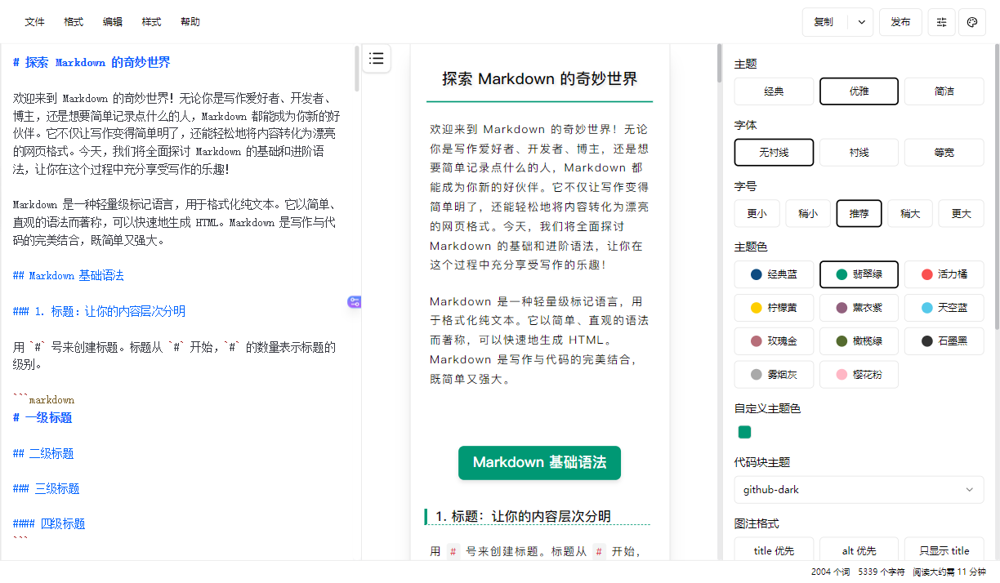

## 软件简介

WeChat Markdown Editor 将 Markdown 文档自动即时渲染为微信图文，让你不再为微信内容排版而发愁！只要你会基本的 Markdown 语法（现在有了 AI，你甚至不需要会 Markdown），就能做出一篇样式简洁而又美观大方的微信图文。

{.cover}

::: center



:::

::: center

:::

## 功能特性

### 核心功能

- **完整 Markdown 支持** 支持所有基础语法、数学公式
- **图表渲染** 支持 Mermaid 图表和 [GFM 警告块](https://github.com/orgs/community/discussions/16925)
- **PlantUML 支持** 强大的 UML 图表渲染
- **Ruby 注音扩展** 支持 `[文字]{注音}`、`[文字]^(注音)` 格式，支持多种分隔符

### 编辑体验

- **代码高亮** 丰富的代码块高亮主题，提升代码可读性
- **自定义样式** 允许自定义主题色和 CSS 样式，灵活定制展示效果
- **草稿保存** 内置本地内容管理功能，支持草稿自动保存

### 高级功能

- **多图床支持** 提供多种图床选择，便捷的图片上传功能
- **文件管理** 便捷的文件导入、导出功能，提升工作效率
- **AI 集成** 集成主流 AI 模型（DeepSeek、OpenAI、通义千问、腾讯混元、火山方舟、302.AI 等），智能辅助内容创作

## 效果展示

::: left

:::

## 系列文章



## 下载地址

::: download



:::

## 软件授权

:::


:::

## 开源协议

WeChat Markdown Editor 源码遵循 [WTFPL-1](https://github.com/doocs/md?tab=WTFPL-1-ov-file) 协议进行分发和使用。
